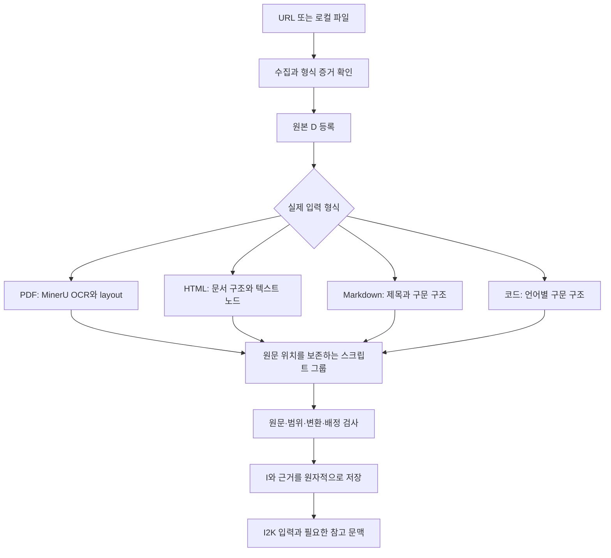

# 여러 입력 형식의 스크립트 기반 D2I

2026-09-11. 사용자 목표는 웹 주소/PDF/Markdown/코드베이스 파일을 스크립트와 MinerU로 처리해, 원문 근거를 보존하는 문맥 그룹 I로 저장하는 것이다. 공통 수집·검증·저장 흐름과 형식별 구조 파서를 조합하는 방향을 채택한다. 아래는 구현 방향이며 HTML/code 등 미구현 기능이 완료됐다는 뜻이 아니다. [설계 검토 기록](../../progress/T03_multiformat_design_execplan.md).

## 구조적 문맥을 I로 만든다

D2I는 원문을 요약하거나 주장·중요도·진실을 판단하지 않는다. 문서가 제공하는 절/문단, 이미지·캡션, 함수·클래스 같은 경계를 이용해 함께 읽어야 할 문맥을 묶는다. 제목이 없거나 역할이 모호해도 원문을 보존하고 불확실성을 남긴다. 멀리 떨어진 내용을 같은 주제라고 추측해 합치는 작업은 이 단계의 기본 동작이 아니다.

저장 I는 고정 token 수나 고정 I 개수로 맞추지 않는다. 긴 절이나 함수도 원문 단위로 보존하고, 모델의 실제 한도를 맞추는 source range별 window는 I2K 입력 준비에서 다룬다. 클래스의 method처럼 원문에 명시된 내부 구조는 별도 범위로 색인할 수 있다. I2K window나 참고 문맥을 만드는 일은 기존 I의 내용을 다시 쓰는 일이 아니다.

## 공통 처리 흐름

URL은 파일 형식이 아니라 수집 경로다. URL이 PDF를 반환하면 PDF parser를, HTML을 반환하면 HTML parser를 선택한다. 등록할 때 확장자·HTTP Content-Type·실제 bytes의 형식 증거를 대조하고 선언된 값과 선택한 형식의 근거를 보존한다. 충돌/미지원은 명시하며 이미 등록한 D의 MIME을 몰래 덮어쓰지 않는다. 실패한 parser를 다른 방식의 성공으로 조용히 대체하지 않는다.

수집 원본의 hash와 parser 산출물의 hash를 구분한다. HTTP 수집은 URL/최종URL/시각/응답 표현을, 파일은 실제 읽은 bytes와 원본 이름·제공된 경로 맥락을 기록한다. 같은 URL이나 같은 파일 경로라도 bytes가 바뀌면 새 D다. Data ID는 계속 등록 bytes의 SHA-256이며 URL/경로/commit ID로 대체하지 않는다.

## 입력별 구현 방향

| 입력 | 구조를 읽는 방법 | 저장 I의 기본 문맥 | 정확한 원문 위치 | 현재 상태 |
|---|---|---|---|---|
| PDF | 선택된 image200 MinerU Hybrid high + Pro2605, 이후 스크립트 | 확인된 절·소절, 원문과 관련 media; page furniture 별도 그룹 | 원본 D/page/bbox/leaf/raw·이미지 SHA, 원문↔파생 좌표 | Test_Paper22 I 실제 저장, 추가3편 조립 검증 |
| Markdown | 고정 CommonMark parser | heading 계층의 절과 하위 표/코드; 제목만 있는 부모 prefix는 첫 자식에 연결 | 원문 UTF8 byte/char/line, heading path | 큰 작성문서24 I 실제 저장 |
| 정적 HTML | HTML 구조 parser, semantic landmark·heading·반복 구조 | 본문 절, 댓글/토론, metadata/UI를 구조 역할별 구분 | raw HTML byte/char 범위, 출력↔원문 변환 map | GeekNews D등록+12그룹 검토, 정식 I저장 미구현 |
| Python 소스 | 표준 AST와 원문/token 범위 | module 설명/imports, 함수·클래스와 직접 붙은 주석/decorator/docstring | 파일 D의 raw byte/char/line, symbol path | 설계 단계 |
| 다른 언어·설정 파일 | 지원 언어별 syntax parser; 작은 설정은 전체 파일도 가능 | 함수·클래스·명시적 설정 영역 | 각 파일의 원문 범위와 언어/grammar profile | 후속 범위·parser 선택 필요 |

모든 형식을 한 번 Markdown으로 바꿔 그것을 원문처럼 저장하지 않는다. 읽기 표현은 공유할 수 있지만 원래 출처와 변환을 보존한다. HTML entity 해석이나 PDF OCR은 원문 구간 복사와 다르며, 코드 AST의 구조 정보도 실제 소스 텍스트 전체가 아니다.

## HTML의 범용성과 별도 수집 경로

정적 HTML은 `main/article/section/nav/footer` 등의 구조와 heading/list/table을 우선 이용한다. 이런 구조가 부족한 부분은 분류가 불확실한 원문 그룹으로 남긴다. 주본문 추정기나 특정 사이트 selector는 역할 제안/명시 profile로 사용하며, 그 결과에 들지 않았다는 이유로 source를 없애지 않는다. GeekNews의 `#topic_contents`는 검토용 예시이며 모든 URL의 필수 조건이 아니다.

원문 raw HTML과 source inventory는 보존하고 읽기용 entity/공백/태그 separator 변환을 기록한다. head/script/style/metadata/숨김 영역의 읽기 포함 정책은 source 범위·이유와 함께 versioned profile에 남긴다. HTML source coverage와 브라우저의 정확한 가시성은 별도로 평가한다. 외부 링크/이미지 descriptor는 실제로 받은 파일이 아니다.

JS 렌더링이 필요한 사이트는 별도의 browser capture profile로 다룬다. HTTP 응답과 렌더링 DOM·확보한 resources는 서로 구분하고 browser/viewport/capture 조건과 hashes를 남긴다. 정적 경로 실패를 몰래 browser/OCR 성공으로 바꾸지 않는다. 범용 웹 수집이라고 모든 로그인·무한스크롤·동적 상태를 얻을 수 있다고 가정하지 않는다.

현재 HTML 시험은 identity 응답·UTF8이다. 다른 charset 또는 content-encoding 지원을 추가할 때는 원본 bytes, 디코딩/압축해제 representation, hash 대상과 위치 변환을 명시한다. 무조건 UTF8로 치환하거나 replacement character를 넣어 성공 처리하지 않는다.

## 코드 파일과 코드베이스 맥락

첫 구현은 현재 저장소의 Python 파일로 시작한다. AST에서 함수/클래스 경계를 얻고 실제 내용은 원문에서 복사한다. 주석·decorator·docstring·imports와 AST 바깥 구간도 inventory에 남긴다. 분석을 위해 해당 파일을 import하거나 프로그램·build·test를 실행하지 않는다.

Python AST 위치의 column은 UTF8 byte offset이므로 Unicode 문자 index와 직접 혼용하면 안 된다. AST 자체도 Python 버전의 문법에 영향을 받는다. 구현에서는 grammar/runtime를 고정하고 원문 byte/char 범위의 변환을 검사한다. [Python AST 공식 문서](https://docs.python.org/3.12/library/ast.html#ast.AST). 다른 언어 확장에는 Tree-sitter 같은 언어별 구문 파서를 검토할 수 있지만 현재 설치/지원 완료로 기록하지 않는다. [Tree-sitter 공식 소개](https://tree-sitter.github.io/tree-sitter/).

초기 기본안은 module 서두/선언부와 top-level 함수·클래스를 문맥 단위로 보존하는 것이다. 클래스 내부 method 범위는 조회 색인으로 제공한다. 실제 요구에 따라 method 단위 저장 profile을 추가할 때도 클래스 선언/필드 범위를 참조하고 원문을 중복 배정하지 않는다. 한 개의 긴 함수를 글자 수에 맞춰 여러 canonical I로 절단하는 규칙은 기본으로 두지 않는다.

imports·호출 이름은 코드에서 관찰한 구문 참조다. 그것이 실제 실행 시의 완전한 호출 관계나 의미적 KEdge라고 확정하지 않는다. 다른 파일의 정의는 원래 파일의 I로 유지하고 I2K 참고 문맥으로 가져온다. 같은 imports를 모든 함수 I 본문에 반복 복사하지 않는다.

파일별 Data 등록을 먼저 사용한다. 저장소 전체 수집을 추가할 때는 선택한 파일의 경로와 Data hash를 snapshot 목록으로 기록하고, commit만으로 실제 working tree bytes를 대신하지 않는다. 동일 bytes가 여러 경로에 있으면 기존 Data 중복 정책을 지키면서 path→기존 Data 연결을 별도로 표현해야 한다. 경로마다 새 Data나 독립 acquisition을 만드는 정책으로 바꾸지 않는다. 전체 저장소를 하나의 archive D로 정의하는 identity 변경은 여기서 확정하지 않는다.

지원하지 않는 언어·문법·인코딩은 명시한다. D의 raw 보존과 성공한 syntax parsing을 구분하며, 원문 텍스트 profile을 선택한 경우에도 구조 정보가 없음을 표시한다. 자동 텍스트 fallback을 성공한 AST 분석으로 가장하지 않는다. 파일 선택·제외·symlink·생성물 범위는 수집 목록에 드러낸다.

## 공통 I 계약과 검증

각 형식의 I가 공유할 책임은 다음과 같다. 이는 논리 계약이며 이 문서에서 새로운 SQL 필드/enum이나 public domain을 동결하는 것은 아니다.

- exact Data와 frozen parser/조립 profile을 참조한다.
- 읽기 content와 실제 보존 media를 유지한다. source 내부를 요약하거나 정보를 지어내지 않는다.
- heading/symbol path와 source 역할은 원문 구조의 힌트로 기록한다.
- PDF region 또는 text byte/char/line 등 실제 source locus를 사용한다.
- 읽기 content가 raw 표현과 다르면 source map과 변환을 기록한다.
- 그룹 소유 source와 참고용 source를 구분한다. context의 반복 제공은 새로운 독립 근거가 아니다.
- 보존 여부·변환 검사·불확실성·실제 모델 전달 여부를 분리한다.

검증은 원본 bytes 보존, parser inventory의 전체 배정, 변환 재생, 그룹 경계의 유용성을 나누어 측정한다. Markdown/코드는 I의 정확한 원문 구간으로 bytes 재조립을 확인할 수 있다. HTML은 raw와 변환 map을 대조한다. PDF에서는 전체 D 파일 보존 및 parser block 배정이 PDF 내용의 OCR 완전성을 증명하지 않으므로 native/raster/discrepancy/그림 검토를 별도로 유지한다. 알려진 구조 누락은 실패이고, 알려진 충실성 경고는 I2K가 원문을 요청하지 않았다는 이유로 해소되지 않는다.

세부 provenance map은 저장소에 유지하고 모델에는 읽기 content와 간결한 I/source range 인용을 제공하는 방향으로 구현한다. raw HTML의 수천 개 token mapping을 모든 호출에 그대로 보내는 것을 공통 계약으로 만들지 않는다. 현재 T04 준비는 선택 I 전체를 반환하므로 source range별 호출 window는 추가 구현이 필요하다.

## 재현성과 구현 순서

원본이 고정되고 parser·grammar·profile·조립 코드가 같으면 Markdown/코드/정적HTML의 스크립트 결과는 재현 가능하도록 검사할 수 있다. MinerU 내부 VLM까지 완전 결정론이라고 주장하지 않는다. PDF는 실제 parser 산출물을 동결하고 그 동일 산출물에서 I 조립이 같음을 검증한다. 웹 재수집이나 모델 재파싱으로 source가 바뀐 경우를 같은 입력의 비결정성으로 혼동하지 않는다. 기존 snapshots를 새 실행 결과로 덮어쓰지 않는다.

1. **정적 HTML을 일반화하고 실제 저장에 연결한다.** 기존 검토의 raw↔content mapping을 기반으로 semantic landmark/불확실한 원문 그룹을 구현하고 HTTP metadata 등록·HTML profile·Runtime·I2K 준비를 함께 검증한다. 여러 구조의 미조정 사이트를 frozen fixture로 시험한다.
2. **Python 소스 파일 adapter를 추가한다.** 현재 코드 파일과 주석/Unicode/decorator/중첩구조/구문오류 fixture에서 원문 coverage·I 저장·위치·retry를 검증한다. 그 후 필요한 언어 grammar를 하나씩 추가한다.
3. **여러 파일 수집과 I2K 입력 계획을 연결한다.** 파일 snapshot 맥락, 같은 D의 인접 범위와 다른 파일 정의 참조, 큰 I의 source range window를 구현한다. embedding은 필요한 추가 검색으로 붙이며 원문 순회/정확한 참조 조회의 선행 조건으로 만들지 않는다.

현재 `d2i.py`의 builder/checker/assembly 연결점과 기존 Artifact Store·Canonical Store·Compiler Runtime을 재사용한다. Runtime과 I2K에 남아 있는 “Markdown이 아니면 PDF” 분기를 source format/locator 처리로 실제 기능 추가와 함께 분리해야 한다. 빈 plugin framework, 형식별 DB·서비스, 사용하지 않는 adapter를 먼저 만들 필요는 없다. K의 의미 추출·검증과 기존 중복/Revision 계약은 T04 이후에 유지한다.
