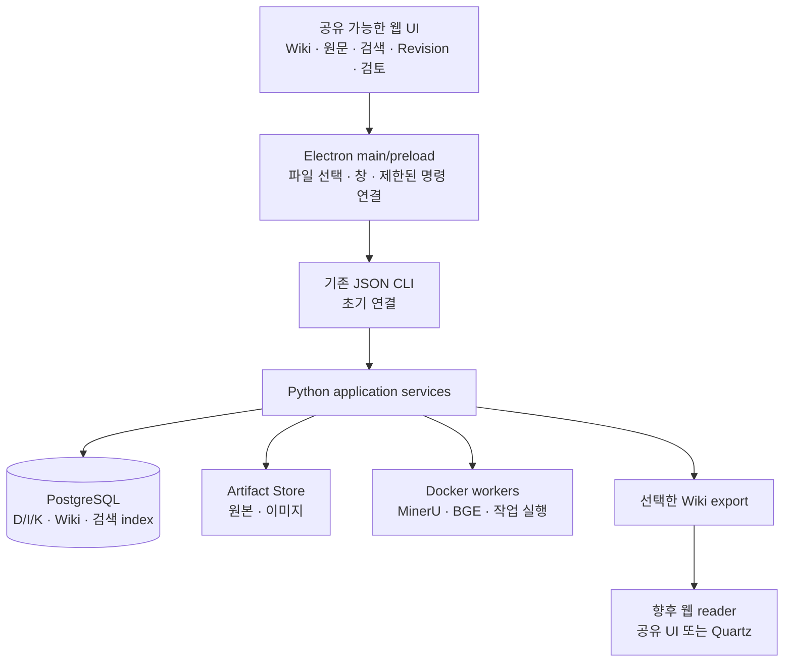

# Electron 직접 UI 적합성 — 2026-09-13

후속: 사용자의 명시적 구현 지시를 받아 [첫 Electron UI](../interfaces/DESKTOP_UI.md)를 실제로 구현·검증했다. 아래 본문은 그 전의 조사 기록이며, 현재 승인·완료 범위는 [착수 결정](../decisions/ELECTRON_UI_START.md)과 [실행 결과](../../output/t09-electron/REPORT.md)를 따른다.

사용자는 기존 Wiki UI 조사에 이어 Electron으로 직접 UI를 만드는 것이 더 적절한지 조사하도록 요청했다. **Palimpsest의 주 작업 앱에는 Electron 기반의 전용 UI를 우선 검토하는 것이 적절하다.** 앞선 Quartz 권고는 자동 생성된 문서를 빠르게 읽고 게시하는 화면에 유효하다. 원문 대조·검토·검색·Revision 탐색까지 한 작업 공간에서 다루는 목표에는 전용 UI의 이점이 더 크다는 후속 판단이다.

이 문서는 공식 자료와 현재 코드 경계에 근거한 설계 권고다. Electron 선택 승인, GUI 구현·설치·배포 또는 성능 실험 결과가 아니다. [배포/backend 조사](../../output/t08-electron-research/deployment-notes.md), [대안·재사용 부품 조사](../../output/t08-electron-research/alternatives-notes.md), [현재 query 계약](../interfaces/WIKI_QUERY.md)을 함께 참고한다.

## 적합하다고 판단한 이유

Palimpsest의 핵심 화면은 문서 하나를 읽는 기능보다 범위가 넓다. 예를 들어 사용자가 Wiki 문장의 인용을 누르면 같은 화면에서 해당 I, 원본 PDF 위치, K의 당시 Revision, 검토 이유를 확인해야 한다. 질문이 미해결이면 모델 답변 대신 누락된 근거와 요청한 자료를 보여주고, 문서를 수정할 때는 과거 snapshot을 보존한 새 검토로 연결해야 한다.

이 흐름은 Electron의 창·파일 선택·단축키·OS 연결과 웹 UI를 조합해서 만들 수 있다. Electron은 JavaScript/HTML/CSS로 데스크톱 앱을 만드는 framework이고 Chromium과 Node.js를 함께 배포한다. **Electron이 완성된 Wiki, 편집기, 그래프 또는 Obsidian 수준의 UX를 제공하는 것은 아니다.** 그 작업 화면은 설계해야 하며 범용 부품을 재사용하는 것이 맞다. [공식 소개](https://www.electronjs.org/docs/latest/), [프로세스·native API](https://www.electronjs.org/docs/latest/tutorial/process-model).

PDF·graph·분할 화면 자체는 브라우저에서도 만들 수 있다. Electron을 선호하는 이유는 로컬 파일 등록, Docker/Python 실행 상태, 데스크톱 작업 공간을 함께 제공하려는 요구다. 웹 서버 중심 사용만 필요하다면 직접 만든 웹 UI도 같은 근거 화면을 구현할 수 있다. 이 점을 Electron만의 시각적 기능처럼 표현하지 않는다.

## 선택지의 역할

다음 적합성 비교는 요구사항에 대한 판단이며 측정 점수가 아니다.

| 선택 | 잘 맞는 역할 | Palimpsest에서 추가로 만들 부분 |
|---|---|---|
| Electron + 전용 웹 UI | 개인용 지식 작업 앱, 로컬 PDF/자료 등록, 문서·원문·검토·작업 상태 통합 | 문서/근거/이력 화면, backend 연결, 설치·업데이트와 UX 품질 |
| Quartz | 검증된 Wiki의 가벼운 읽기·게시 화면 | query 패널·exact provenance·검토/편집 작업 공간 |
| Wiki.js | 계정·권한과 브라우저 공동 편집 중심 Wiki | 외부 page ID 매핑, Palimpsest 검토/출처·Revision 연결 및 편집 되돌림 |
| Tauri + 전용 웹 UI | 같은 작업 UI를 OS WebView 기반 desktop shell로 배포하는 대안 | 전용 UI와 backend 연결, Rust build toolchain, OS별 WebView 검증 |

Quartz/Wiki.js의 제공 기능과 근거는 [기존 UI 조사](WIKI_UI_INTEGRATION.md)에 있다. Electron과 Tauri는 완성된 Wiki 제품이 아니라 앱 기반이므로, 제품 기능 개수만으로 비교하면 안 된다.

## 권고 구조

권고 배치는 **Electron은 사용자 OS에서 실행하고 Python/PostgreSQL/모델 backend는 기존 Docker 구조로 유지**하는 것이다. UI shell/화면에는 JavaScript 또는 TypeScript가 필요하지만 앱의 source 처리·검색·검증·canonical 저장 로직은 Python에 남는다. Electron main이나 renderer가 PostgreSQL을 직접 수정하거나 K/W 승인 규칙을 복제하지 않는다.

초기 연결은 기존 `palim ... --json`의 typed 명령·ID·상태를 재사용할 수 있다. Electron main은 비동기 `spawn`/`execFile`로 허용된 executable과 인자를 전달한다. `utilityProcess.fork`는 Node module 실행 기능이며 Python을 자체적으로 내장하는 API가 아니다. [Node child_process](https://nodejs.org/api/child_process.html), [Electron utilityProcess](https://www.electronjs.org/docs/latest/api/utility-process).

문서 선택마다 새 Docker 컨테이너를 띄우는 구조의 지연은 측정해야 한다. 반복 조회·진행 이벤트가 필요한 실제 UI 단계에서는 같은 Python service를 호출하는 작은 지속 연결/RPC/API를 두는 안이 유리하다. 그때도 CLI와 GUI는 동일한 service를 이용한다. 현재 API가 이미 존재하는 것처럼 취급하거나 조사 단계에서 서버를 추가하지 않는다.

화면 부품은 Electron API에 직접 의존하지 않게 두고 파일 선택·OS 동작만 main/preload에 모은다. 그러면 향후 웹 reader에서 문서·인용·graph·질문 결과 component를 재사용할 수 있다. 다만 인증, 서버 transport, 공개 경로와 배포는 별도 작업이며 desktop 앱을 그대로 웹에 배포할 수 있다는 뜻은 아니다. Electron renderer가 웹 기술을 사용한다는 점에 근거한 설계다. [Renderer 모델](https://www.electronjs.org/docs/latest/tutorial/process-model).

## 재사용할 수 있는 부품

다음은 후보이며 설치하거나 version을 고정한 목록이 아니다. React는 필수 선택이 아니며 기존 웹 component 조합의 한 예다.

| 부분 | 후보 | 직접 구현할 연결 |
|---|---|---|
| 공통 화면 component | React / TypeScript | 분할 화면, 데이터·상태 연결, 키보드·한글 UX |
| PDF/원본 근거 | PDF.js 또는 첫 단계의 보존 page image | exact Data/page/좌표와 I 인용 연결, 확대·회전 시 강조 영역 |
| Markdown 수정·차이 | CodeMirror Markdown/merge | 읽기 전용 과거 snapshot, 새 수정 제안, 검토 결과 |
| K·문서 graph | Cytoscape.js | 문서 링크·shared-source 연결·semantic Edge 구별, exact Revision 선택 |

공식 근거: [React 통합](https://react.dev/learn/add-react-to-an-existing-project), [PDF.js 예제](https://mozilla.github.io/pdf.js/examples/), [CodeMirror Markdown](https://raw.githubusercontent.com/codemirror/lang-markdown/main/README.md), [merge](https://raw.githubusercontent.com/codemirror/merge/main/README.md), [Cytoscape.js](https://js.cytoscape.org/). React·CodeMirror·Cytoscape core는 MIT, PDF.js는 Apache-2.0으로 확인했다. 세부 링크와 CodeMirror 저장소 이전에 따른 확인 범위는 [부품 조사](../../output/t08-electron-research/alternatives-notes.md)에 있다.

PDF viewer가 citation provenance를 만들어 주지는 않는다. PDF user coordinates와 OCR raster/source coordinates의 보존된 대응을 적용하고 crop/rotation/scale을 반영해야 한다. PDF.js의 페이지·viewport API를 사용해 원본 좌표를 화면으로 변환할 수 있지만, 조사한 최신 master에는 예전 `convertToViewportRectangle` helper가 없으므로 선택한 배포판의 정확한 API를 확인해야 한다. 문자별 glyph 좌표가 없으면 block 영역을 표시하고 문자별 정확도를 가장하지 않는다. [PDFPageProxy](https://mozilla.github.io/pdf.js/api/draft/module-pdfjsLib-PDFPageProxy.html), [현재 PageViewport](https://raw.githubusercontent.com/mozilla/pdf.js/master/src/display/page_viewport.js).

## 부담과 한계

**직접 만드는 UI의 범위가 커진다.** 탭·분할·탐색 이력·검색 결과·키보드·한글 입력·오류 표시·접근성을 다듬는 작업은 남는다. Electron을 선택했다는 사실만으로 기존 Wiki 제품보다 완성도가 높아지지는 않는다. 그래서 첫 목표를 문서→근거→원본의 한 흐름으로 좁히는 것이 적절하다.

**배포는 UI와 backend 두 부분을 관리한다.** Electron Forge와 Electron의 배포·업데이트 기능을 사용할 수 있지만, UI 패키징·서명·업데이트와 Python image·DB schema/profile 호환성을 따로 검증해야 한다. UI 업데이트를 이유로 live DB migration을 자동 수행해서는 안 된다. [Electron Forge](https://www.electronforge.io/), [배포](https://www.electronjs.org/docs/latest/tutorial/distribution-overview), [서명](https://www.electronjs.org/docs/latest/tutorial/code-signing).

**Chromium/Node 동봉과 지속적인 업데이트가 필요하다.** 공식 지원 정책은 최신 stable major 3개다. 설치 용량·RAM·시작 시간의 실제 수치는 이번에 측정하지 않았으며 작은 예제 앱의 수치를 Palimpsest에 적용하지 않는다. 대형 PDF의 보이는 페이지만 렌더링하고 목록·graph를 필요한 범위로 표시하는 동작을 검증해야 한다. [지원 정책](https://www.electronjs.org/docs/latest/tutorial/electron-timelines), [성능 지침](https://www.electronjs.org/docs/latest/tutorial/performance).

**앱 창과 장기 작업은 수명이 다르다.** 창을 닫아도 진행 중 작업을 보존하는 책임은 Python Runtime의 durable job 상태에 둔다. main process를 tray에 남기는 것만으로 crash·OS 종료·업데이트 후의 정확한 재개가 구현되지 않는다. 현재 query Runtime의 완전한 T11 재개·취소 기능도 별도로 남는다. [Electron lifecycle](https://www.electronjs.org/docs/latest/api/app), [Docker restart policy](https://docs.docker.com/engine/containers/start-containers-automatically/).

**OS 공통 UI가 GPU backend 이식성을 보장하지 않는다.** Electron은 Windows/macOS/Linux UI를 지원하지만 현재 MinerU/BGE CUDA profile의 Mac 이식은 별도다. Docker Desktop의 일반 container GPU 안내는 Windows WSL2/NVIDIA 경로를 명시한다. Mac에는 검증된 대체 runtime 또는 원격 GPU backend 연결이 필요할 수 있다. [Docker Desktop GPU](https://docs.docker.com/desktop/features/gpu/).

## 원문 표시의 경계

이 앱은 외부 HTML·Markdown·PDF·모델 출력을 표시한다. 원본은 보존하되 UI에서는 실행 가능한 script와 OS 접근을 제한해야 한다. `contextIsolation`, sandbox와 최소 IPC를 사용하고 renderer에 DB/provider credentials, 임의 shell/filesystem API를 넘기지 않는다. 문서의 링크나 텍스트가 backend 명령이 되어서는 안 된다. 이는 Palimpsest의 실제 입력 종류에 필요한 설계 조건이다. [Electron 보안](https://www.electronjs.org/docs/latest/tutorial/security), [IPC](https://www.electronjs.org/docs/latest/tutorial/ipc).

UI 버튼 역시 실제 backend confirmation/expected-head/검증을 호출해야 한다. 문서 편집을 canonical K 변경 또는 사용자 Decision 확정으로 간주하지 않는다. 자료 등록은 도구 관리 경로를 이용하고 source 조회가 D2I를 재실행하지 않게 유지한다. 원본 PDF를 UI에서 보여주는 것과 모델에 PDF bytes를 전달했다는 기록도 별개다.

## Tauri를 우선하지 않은 이유

Tauri도 같은 전용 UI와 Python backend를 연결할 수 있다. Chromium을 동봉하지 않고 Windows WebView2, macOS WKWebView, Linux WebKitGTK를 사용한다. 따라서 shell 배포 크기에는 이점이 있을 수 있지만 여러 engine의 PDF·편집기·한글 입력 동작을 검증해야 한다. [Tauri WebView](https://v2.tauri.app/reference/webview-versions/), [sidecar](https://v2.tauri.app/develop/sidecar/).

현재는 정교한 PDF/편집 작업 화면과 web component 재사용, renderer engine 버전 관리의 예측 가능성을 우선해 Electron을 먼저 검토하는 판단이다. 전체 시스템의 자원 사용량이 주요 제약으로 확인되거나 Rust/Tauri 운영이 유리한 상황이면 같은 작은 화면으로 비교할 수 있다. Tauri의 UI가 본질적으로 열등하거나 Electron이 항상 빠르다는 주장은 아니다.

## GUI 착수 후 첫 수직 구현 제안

1. 논문·주제 목록과 고정 Wiki page를 현재 PG snapshot에서 읽는다.
2. 문장 인용을 누르면 I 내용과 보존 원본 page를 옆에 표시한다. Data/source execution/Revision을 함께 확인한다.
3. 현재 query의 answered/needs_review/needs_attention과 근거·이력을 표시한다. 새로운 모델 호출 여부는 작업 동작으로 드러낸다.
4. 같은 페이지의 과거 snapshot 비교를 연결하고, 이후 Markdown 수정 제안·graph·작업 관리로 넓힌다.

이 첫 화면에서 source 불변, 정확한 위치·회전·확대, 한글 입력/검색, backend 오류·재접속·schema 불일치, 창 종료 후 상태를 실제로 검사한다. GUI 시작은 현재 T13 경계에서 별도로 결정하며 이번 조사로 구현 완료나 착수 승인을 대신하지 않는다.

## 이번 실행 범위

공식 문서·코드와 현재 application service/CLI 경계를 읽고 조사 문서와 문서 인덱스만 갱신했다. npm 설치·Electron/Tauri scaffold·GUI/API/DB 변경·Docker 실행·앱 테스트·LLM provider 호출·성능 측정은 수행하지 않았다. 기존 0.8.0 앱·0010 schema·원문·이미지·model profile과 과거 검증 결과는 그대로다. 문서 검사는 기존 raw Markdown 오류12개 baseline과 구분해 실행 계획에 기록한다.
