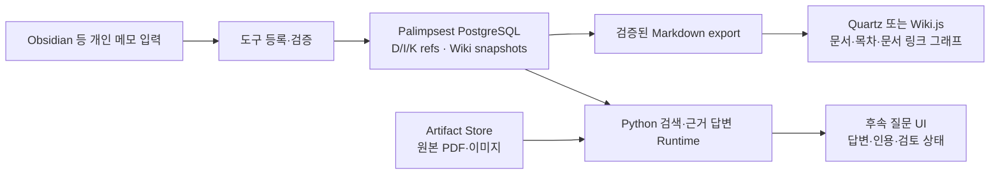

# 기존 Wiki UI를 이용하는 연결 설계

**2026-09-13 Electron 후속 조사:** [Electron 직접 UI 적합성](ELECTRON_UI_ASSESSMENT.md)을 추가했다. 원문 대조·검색·검토·Revision을 함께 다루는 주 작업 앱에는 Electron 전용 UI를 우선 검토하고, 아래 Quartz 권고는 읽기·게시 화면에 적용하는 것으로 역할을 구분한다. 사용자 요청은 조사이며 제품 선택·GUI 구현/설치/배포 승인이 아니다. 아래 2026-09-12 조사는 당시의 근거로 보존한다.

2026-09-12. 사용자는 검색답변 구현과 함께 Obsidian+Quartz, Wiki.js 및 다른 성숙한 Wiki UI를 조사하도록 요청했다. 공식 자료 조사 결과와 Palimpsest에 대한 설계 권고를 구분한다. UI를 설치·배포하거나 원본 논문을 인터넷에 게시한 작업은 없다. [Quartz/Obsidian 상세 조사](../../output/t07-wiki-query-ui/quartz-obsidian-research.md), [Wiki.js/BookStack/Outline 상세 조사](../../output/t07-wiki-query-ui/wiki-platform-research.md).

## 권고

**현재 목표인 자동으로 확장되는 논문·주제 위키의 첫 읽기 UI에는 Quartz를 우선 검증하는 것이 적합하다.** 이미 만든 고정 Markdown과 내부 링크를 그대로 활용하면서 목차·검색·backlinks·문서 graph·수식·코드·미리보기의 상당 부분을 가져올 수 있다. 이는 구현 비용과 현재 read/export 경로에 근거한 설계 판단이며, 우리 25개 페이지를 Quartz에서 실제 빌드해 검증했다는 뜻은 아니다. [Quartz 공식 기능](https://quartz.jzhao.xyz/).

**브라우저에서 여러 사람이 편집하고, 계정·권한을 관리하는 기능이 우선이면 Wiki.js가 더 직접적인 후보**다. PostgreSQL과 GraphQL page/history API를 갖추어 Palimpsest의 문서를 별도 Wiki.js DB에 반영하는 연결기를 만들 수 있다. 이 경우 자체 문서 DB·권한·편집 이력을 함께 운영해야 하며, generated page의 편집을 Palimpsest에 되돌리는 검토 경로가 필요하다. [공식 GraphQL API](https://docs.requarks.io/dev/api), [stable page schema](https://raw.githubusercontent.com/requarks/wiki/v2.5.314/server/graph/schemas/page.graphql).

Obsidian은 선택적인 개인 입력·열람 클라이언트로 두는 편이 자연스럽다. 서버가 자동 위키를 갱신하는 데 데스크톱 Obsidian 실행을 필수로 만들 필요는 없다. Obsidian CLI는 앱 실행을 요구하고, 별도 Headless는 Sync/Publish 클라이언트이며 자체 호스팅 웹 위키 서버가 아니다. [Obsidian CLI](https://obsidian.md/help/cli), [Headless](https://obsidian.md/help/headless).

## 후보 비교

| 후보 | 바로 활용할 UI | Palimpsest와 연결하는 방식 | 현재 판단 |
|---|---|---|---|
| Quartz + 선택적 Obsidian | 문서 탐색·backlinks·local/global graph·검색·수식·모바일 읽기 | PG의 검증된 export → 별도 Quartz content → 정적 웹 UI | 자동 생성 문서의 읽기 UI 우선 후보 |
| Wiki.js | 브라우저 editor·검색·로그인·권한·문서 history | GraphQL로 page upsert, 외부 page ID ↔ Palimpsest page/snapshot ID mapping | 온라인 편집·권한이 핵심일 때 우선 |
| Outline | 협업 문서 editor·collections·자동 backlinks | API로 문서 반영, 외부 ID mapping 및 편집 검토 | 협업 UX 후보, 제품화 라이선스 조건 확인 필요 |
| BookStack | Shelf/Book/Chapter/Page·editor·검색·references | REST/Markdown import-export 연결 | 책·매뉴얼 중심에 적합, 별도 MySQL/MariaDB 운영 필요 |

기능 근거: [Quartz graph](https://quartz.jzhao.xyz/features/graph-view), [Quartz 한국어 토큰화 검색](https://quartz.jzhao.xyz/features/full-text-search), [Wiki.js page/history schema](https://raw.githubusercontent.com/requarks/wiki/v2.5.314/server/graph/schemas/page.graphql), [Outline backlinks](https://docs.getoutline.com/s/guide/doc/backlinks-f9YSmlNSkr), [BookStack 설치 요구사항](https://www.bookstackapp.com/docs/admin/installation/). 제공 기능이 우리 데이터에서 정상 동작하는지는 별도 compatibility 검사다.

Quartz 공식 현재 문서는 **v5.0.0 / 2026-09-06**이며 Node ≥22/npm ≥10.9.2와 새 플러그인 구성을 안내한다. 이번 조사에서 v5의 exact stable tag/commit은 확정하지 않았으므로 예전 v4 설치법을 그대로 적용하거나 branch 이름만으로 설치 버전을 고정하지 않는다. 선택 후 commit·lockfile·플러그인·Docker base를 함께 고정해야 한다. [현재 공식 안내](https://quartz.jzhao.xyz/), [업그레이드 안내](https://quartz.jzhao.xyz/getting-started/upgrading).

확인한 다른 stable release는 Wiki.js **2.5.314**, BookStack **26.05.4**, Outline **1.10.1**이다. 라이선스는 각각 AGPL-3.0, MIT, BSL 1.1이며 Outline의 현재 license에는 정의된 상업적 Document Service 사용 제한이 있다. Obsidian은 무료 사용 가능한 독점 앱이므로 선택적인 외부 클라이언트 사용과 소스/앱 재배포를 구별한다. [Wiki.js release/license](https://github.com/requarks/wiki/releases/tag/v2.5.314), [BookStack release](https://github.com/BookStackApp/BookStack/releases/tag/v26.05.4), [Outline license](https://raw.githubusercontent.com/outline/outline/main/LICENSE), [Obsidian license](https://obsidian.md/license).

## 저장소와 UI의 역할

이 구성에서 최종 문서 본문·출처·Revision·검토 상태는 Palimpsest가 관리한다. 외부 UI의 DB나 Markdown cache는 다시 만들 수 있는 표시용 사본이다. UI만 교체하더라도 I의 원문 위치나 KRevision을 다시 생성하지 않는다. 외부 Wiki의 자체 history를 canonical history로 바꾸지도 않는다.

문서 graph의 선은 논문↔주제의 링크다. N2E가 판정한 supports/contradicts 관계와 같은 의미를 부여하지 않는다. 관련 K 패널에는 현재와 당시 Revision, 추론 기원 유무/불명확, 검토 표시를 별도로 보여준다. 페이지 전체가 하나의 KNode라고 가장하지 않는다.

## 별도로 연결해야 하는 UI

기존 제품이 대신하지 않는 핵심은 다음과 같다.

- 질문의 **답변 / 주장별 근거 / 추가 원문 요청 / 검토 상태** 표시. 페이지 검색과 BGE/I 검색을 구분한다.
- 인용 클릭 시 exact I text와 Data/source execution, PDF page·bbox, 원본 이미지로 이동하는 provenance resolver.
- 이전 Wiki snapshot와 당시 KRevision을 함께 선택하는 history 화면.
- 자동 생성 본문과 사용자의 작성·수정 제안을 구분하는 편집 경로. 사용자의 메모를 실제 확인된 Decision으로 자동 확정하지 않는다.

따라서 기존 UI로 상당 부분을 충족할 수 있지만, 설치만으로 rigid LLM Wiki의 근거·검토 기능까지 완성되는 것은 아니다. 이번에 구현한 [질문 CLI와 JSON/Markdown 결과](../interfaces/WIKI_QUERY.md)를 후속 웹 UI가 소비하도록 연결하면 검색 로직을 프런트엔드에 다시 구현할 필요가 없다.

## 첫 UI 연결의 검증 항목

1. 현재 논문 3·주제 22 페이지의 고정 제목, UUID 기반 stable 경로, 73개 문서 링크와 backlinks를 유지한다.
2. BMDC와 한국어·영어 검색, 수식·표·그리스 문자, 이미지와 PDF `#page` 링크를 실제 브라우저에서 검사한다. 기본 검색의 한국어 토큰화 문서와 실제 검색 품질을 구분한다.
3. 새 catalog를 선택하면 완성된 export 묶음을 반영하고, 중간 빌드 실패가 현재 화면을 깨뜨리지 않게 한다. 과거 snapshot 링크를 그대로 남긴다.
4. UI content에는 선택한 export만 넣고 Compiler 요청/receipt·DB dump·credential·query 작업 폴더는 포함하지 않는다. 원본 파일의 화면 제공 범위는 해당 배포 설정에서 결정한다.
5. 질문 패널이 서로 다른 실험을 합치지 않고 검토 필요 답변을 확정된 본문으로 표시하지 않는지 검사한다.

Quartz를 선택하면 먼저 정적 읽기 UI를 검증하고 질문·provenance 패널을 연결한다. 온라인 협업이 첫 요구로 바뀌면 같은 export/ID 계약으로 Wiki.js 연결을 우선할 수 있다. 이번 조사는 선택 근거이며 GUI 착수·공개 게시·정식 P 계약 변경의 완료 기록이 아니다.
