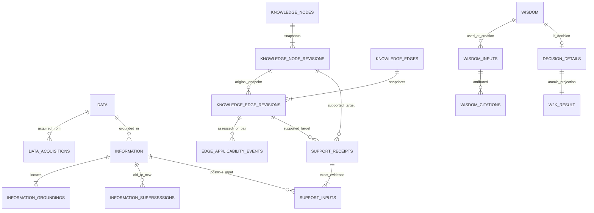
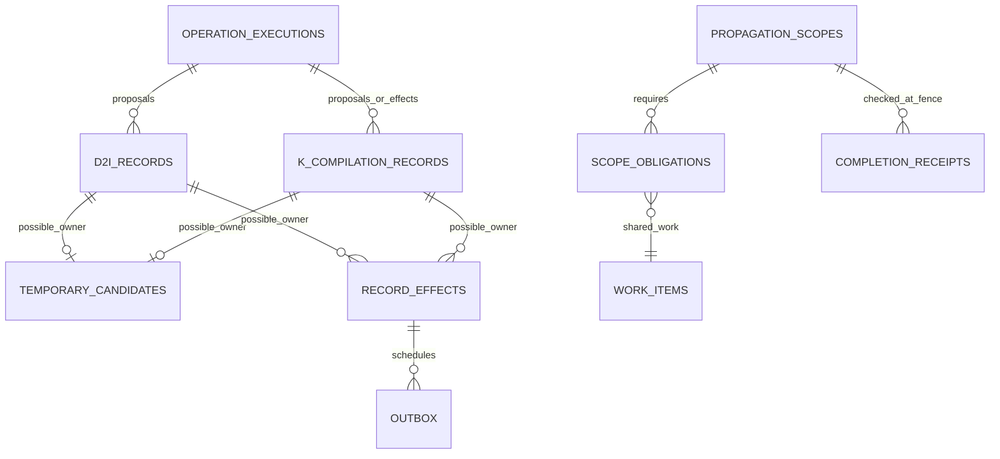

# D/I/K/W PostgreSQL 저장 스키마 v1

상태: **T01 REVIEW DRAFT / DB 미적용 / 앱 acceptance 미실행**. 작성일: 2026-09-09. 사용자가 ERD·필드·제약·트랜잭션·단계별 migration 계획 작성을 지시한 범위의 설계 산출물이다. PostgreSQL 18 + pgvector, Python/Docker와 U01–U10의 동작을 구체화한다. 전체 P01–P12 승인이나 production schema 동결 선언은 아니다.

후속 실행: T02에서 D·acquisition·등록 journal만 별도 `0001_data` migration으로 구현해 실제 PostgreSQL에 적용하고 검증했다. [T02 결과](../../progress/T02_execplan.md)를 따른다. 이 v1 문서 전체의 I/K/W/Compiler/검색 테이블이 적용됐다는 뜻은 아니다.

## 1. 설계 범위와 권위

기준은 [사용자 선택](../decisions/USER_OVERRIDES.md), [U08/R01–R09](../decisions/ARCHITECTURE_FIXES.md), [U09 저장·ID](../decisions/STORAGE_IDENTITY.md), [현재 relational skeleton](../canonical/10_relational_vocabulary.md), [모듈 경계](../implementation/MODULE_BOUNDARIES.md)다. 기존 canonical 의미를 변경하지 않으므로 canonical full/slices/map은 이 문서 작성으로 다시 발행하지 않는다.

이 문서의 “기존 계약”은 승인된 의미·책임이고, “v1 구현안”은 이를 저장할 자료형·내부 관계·제약의 검토안이다. 새 내부 테이블 이름은 public domain/Operation/Record subtype 추가가 아니다. “미정” 항목은 §13에 모아 영향받는 migration만 보류한다. 필드 목록은 필수 저장 계약이며 실제 migration의 모든 index·constraint 이름을 미리 고정하지 않는다.

하나의 PostgreSQL database 안에 `canonical_store`, `compiler_runtime` schema를 둔다. D/I/K/W/P/B 코드 모듈은 같은 짧은 commit 서비스를 공유한다. Artifact Store는 관리 파일 저장소이며 PDF bytes를 PG의 Data row에 중복 적재하지 않는다. parser 결과·후보와 모델 cache는 canonical 내용과 구분한다.

## 2. 공통 자료형·참조 규약

표에서 `?`는 nullable이다. 별도 표시가 없는 기본 필드는 NOT NULL이다. 조건부 필드는 값의 존재 조건도 함께 검증한다. 아래 이름은 문서상의 표기이며 새로운 PostgreSQL 사용자 정의 타입을 생성하라는 지시가 아니다.

| 표기 | v1 PostgreSQL 표현 | 검증·의미 |
|---|---|---|
| Data ID | `text COLLATE "C"` | 원본 bytes SHA-256의 lowercase hex 64자리; 기존 D 초안 유지 |
| 신규 opaque ID | `uuid` | UUIDv7 형식 검사; 객체·Revision·Record·profile·event에 적용 |
| FP | `text` + `fp_profile_id uuid` FK | 원본 hash와 구분; profile이 normalization/algorithm/version/scope를 고정. 과거 FP를 재계산하지 않음 |
| 시간 | `timestamptz` | created/decided/effective 시각 구분. 시각이나 UUIDv7 정렬을 commit order로 사용하지 않음 |
| 순번·generation·version | `bigint` 또는 작은 ordinal의 `integer` | 비음수 또는 양수 CHECK. UUID로 바꾸지 않음 |
| 통제된 kind/상태/코드 | `text` + CHECK 또는 versioned registry FK | 임의 문자열 거부. 기존 확정값만 seed하고 미정 enum을 placeholder로 넣지 않음 |
| 의미 payload | `jsonb` + 불변 payload schema/profile FK | v1 저장안. kind별 구조를 Python에서 검증하고 필요한 SQL CHECK 병행. 핵심 참조·권한·결과 필드는 별도 column/FK |
| 표시 본문 | `text` | 원문 bytes나 의미 identity의 대체물이 아님 |
| 원문 위치 | typed page/offset/region columns + extractor profile FK | parser 좌표계·offset 단위·anchor 의미를 함께 고정 |
| 벡터 | pgvector `vector` 및 profile별 차원 검사 | 검색 파생물. 임의 차원 절삭·정밀도 변경 금지 |

JSONB 자체의 표시 순서나 `jsonb::text`를 FP 계산 규약으로 삼지 않는다. 의미 fingerprint는 profile에 고정한 canonical serialization에서 계산한다. exact 원문 bytes는 D/Artifact Store에 보존한다. PostgreSQL JSONB는 원래 공백·key 순서·중복 key를 그대로 보존하는 형식이 아니다. [PostgreSQL JSON 자료형](https://www.postgresql.org/docs/18/datatype-json.html)

### 2.1 Typed FK 표기

- `RecordRef`: `d2i_record_id uuid?`와 `k_record_id uuid?` 중 정확히 하나를 실제 parent table FK로 연결한다. root/parent/matched가 D2I와 K를 가로지를 때도 이 원칙을 적용한다. optional ref는 둘 다 NULL이거나 정확히 하나만 존재한다.
- `KRevisionRef`: `knode_revision_id uuid?`와 `kedge_revision_id uuid?` 중 정확히 하나. current logical ID만 저장하지 않는다.
- `CanonicalRef`: 해당 관계가 허용하는 Data/I/K revision/W/P/B의 명시적 FK columns 중 정확히 하나. 모든 종류를 받는 전역 object registry는 만들지 않는다.
- `EffectiveEdgeRef`: `semantic_kedge_revision_id`, 실제 `from_knode_revision_id`, `to_knode_revision_id`, `basis_type`, `applicability_event_id?`, `read_commit_order`를 보존한다. 모두 uuid FK 또는 통제값/정수 column이며 임의 JSON ref가 아니다.

EffectiveEdgeRef의 basis가 explicit event이면 event의 semantic revision/pair가 모두 일치해야 한다. 최초 승인 basis이면 event FK는 NULL이고 pair가 해당 edge revision의 최초 pair와 같아야 한다. `basis_type`의 내부 spelling은 migration에 명시한다. historical negative/pending 조회 자료와 실제 사용 가능한 positive input을 구분한다.

PK 존재만으로 “Revision이 이 Node에 속한다”가 보장되지는 않는다. `UNIQUE(owner_id, revision_id)`와 composite FK로 소속을 묶는다. optional composite ref는 반쪽 NULL을 막는다. FK로 표현하기 어려운 type/ownership 조건은 commit-end constraint trigger로 검증한다. 행 간 규칙을 다른 테이블을 읽는 CHECK 함수로 숨기지 않는다. [PostgreSQL 제약](https://www.postgresql.org/docs/18/ddl-constraints.html)

## 3. ERD — 의미 객체와 정확한 근거

아래는 주요 관계다. 각 물리 FK와 조건부 관계는 후속 표가 정의하며 화살표가 자동 cascade/update를 뜻하지 않는다.

후보/효과의 두 possible owner는 동시에 존재하지 않는다. support receipt도 Node/Edge revision 중 정확히 하나를 target으로 갖는다. W2K_RESULT는 §7의 성공 연결을 도식화한 이름이며 새 domain/table을 강제하지 않는다. P/B는 §11에서 연결 경계를 정의한다.

## 4. D — 등록된 원본과 수집 provenance

기존 [T02 스키마 초안](T02_STORAGE_SCHEMA.md) 및 [SQL](T02_storage_draft.sql)의 세 테이블을 첫 migration 입력으로 유지한다.

| 테이블 | 주요 필드·자료형 | 관계·제약 |
|---|---|---|
| `canonical_store.data` | `data_id text` PK, `sha256` generated, `media_type text`, `byte_size bigint`, `artifact_path text`, `original_name text?`, `created_at timestamptz` | hash 형식, 비음수 크기, hash 기반 유일 경로, 불변 row |
| `canonical_store.data_acquisitions` | `acquisition_id uuid` PK, `data_id text` FK, `origin_uri text?`, `import_method text`, `retrieved_at timestamptz?`, `original_name text?`, `external_metadata jsonb?`, `actor_ref text?` | Data 소속, append-only. 평범한 duplicate가 acquisition을 자동 추가하지 않음 |
| `compiler_runtime.data_import_requests` | `request_id uuid` PK, `request_fingerprint text`, frozen hash/size/media/등록 metadata, `state text`, typed result Data/acquisition FKs, `error_code text?`, 시각 | staged→published→committed; duplicate/failed와 명시적 retry. 동일 성공 request는 결과 재생 |

파일의 존재·hash·path containment·reparse point와 fsync/publish 복구는 Artifact Store adapter 책임이다. PG의 FK만으로 파일과 DB의 원자성을 주장하지 않는다. 동일 bytes의 새 요청을 거부하되, canonical Data 없이 object 파일만 먼저 존재하는 상태는 recovery 경로로 처리한다. 동일 논문의 다른 bytes에 대한 의미 중복 기각은 추가하지 않는다.

## 5. I — Data별 불변 Information

기존 의미는 [Information](../canonical/02_information.md)을 따른다.

| `canonical_store.information` 필드 | 자료형 | 저장 규칙 |
|---|---|---|
| `information_id` | uuid PK | 승인된 snapshot 하나; 별도 InformationRevision 없음 |
| `data_id` | text FK | 직접 근거 D 하나. `UNIQUE(information_id, data_id)`로 grounding 소속 FK 지원 |
| `kind` | text + registry version | 검증·입력 schema 선택. 정확한 I kind registry는 T03 전에 확정 |
| `semantic_payload` | jsonb | kind schema를 통과한 의미 구조 |
| `payload_profile_id` | uuid FK | normalization/output schema를 고정 |
| `human_readable_content` | text | 승인 당시 읽기 표현; 새 표시 cache가 identity를 바꾸지 않음 |
| `identity_fingerprint`, `content_fingerprint` | FP | I identity에는 exact D·grounding locus·의미 identity 포함 |
| `fp_profile_id` | uuid FK | FP 계산 규약 보존 |
| `origin_d2i_record_id` | uuid FK | 최초 승격한 D2IRecord. `(origin_d2i_record_id,data_id)` composite FK로 같은 D 소속 보장. 추가 검증 이력은 별도 Record |
| `created_at`, `commit_order` | timestamptz, bigint | 최초 승인 시각과 저장 순서. 이후 snapshot 불변 |

I identity/content FP에는 cross-Data 전역 UNIQUE를 두지 않는다. 같은 D/locus의 semantic identity가 같아도 content·grounding 교정으로 새 snapshot이 필요할 수 있어 `identity_fingerprint` 하나만 UNIQUE로 묶지 않는다. exact reuse/identity 경쟁은 versioned projection과 frozen grounding bundle을 검증하는 commit guard로 다룬다. exact-key 컬럼 조합은 §13의 P01 상세에 포함한다.

| 부속 테이블 | 필드·관계 | 제약과 변경 규칙 |
|---|---|---|
| `information_groundings` | `grounding_id uuid` PK, `information_id uuid`, `data_id text`, `ordinal integer`, `locator_kind text`, `extractor_profile_id uuid`, `parse_artifact_id uuid?`, `page_no integer?`, `start_offset bigint?`, `end_offset bigint?`, `x0/y0/x1/y1 double precision?`, `anchored_text_hash text?` | `(information_id,data_id)` FK, 같은 I 내 ordinal 유일. page/offset/bbox의 단위·기준 좌표는 extractor profile로 고정; locator kind별 required/null/범위와 stable anchor를 검사 |
| `information_supersessions` | `supersession_id uuid` PK, old/new Information FKs, `replacement_set_id uuid` FK, origin RecordRef, reason codes, commit order | old≠new, pair 중복 방지, 다대다 허용, DAG 검사. 참조 교체 없이 append-only |
| `information_invalidations` | `invalidation_id uuid` PK, I FK, origin RecordRef, reason codes, commit order | 대체 I 없는 명시적 판정. 과거 I 삭제 없음 |
| `compiler_runtime.information_replacement_sets` | `replacement_set_id uuid` PK, 준비 execution/profile, frozen old-I 집합, 기대 proposal members, 검증/게시 상태 | old/new member는 typed FK rows. 모든 replacement가 검증되기 전 canonical에 부분 활성화하지 않음 |

grounding의 bounding box 4개는 함께 있거나 함께 NULL이어야 하며 finite/order 조건을 검사한다. 텍스트 offset은 단위와 끝 포함 여부를 profile로 고정하고 원문 범위 검증은 adapter에서 한다. 페이지가 있다는 이유만으로 MinerU 추출 성공을 I 승인으로 간주하지 않는다. 하나 이상의 유효 grounding 존재와 source Data 일치는 commit-end 검사다.

`compiler_runtime.parse_artifacts`는 parse artifact UUID PK, Data FK, extractor profile FK, 관리 `artifact_path`, artifact digest/형식, page coverage/결과 상태와 생성 시각을 저장한다. MinerU Markdown/JSON/images는 이 비canonical artifact의 종류이며 원본 D의 대체가 아니다. grounding의 parse artifact FK가 있으면 같은 Data/extractor profile에 속함을 composite FK로 검사한다. historical grounding이 참조하는 parse metadata/profile을 임시 candidate cleanup과 함께 삭제하지 않는다. 물리 파생 파일의 보존은 원문 stable anchor로 가능한 재현 범위 및 보존 정책과 함께 명시한다.

I의 현재 usability는 invalidation 및 게시 완료한 supersession에서 계산한다. snapshot UPDATE로 `invalidated=true`를 역사 대신 사용하지 않는다. 최초 grounding bundle은 불변이며 의미/locator 교정은 새 I를 만든다. 기존 exact I의 추가 검증·attribution은 해당 Record/검증 관계에 남긴다.

## 6. K — 논리 identity, 의미 Revision, 현재 근거

### 6.1 Node와 Edge

| 테이블 | 필드·자료형 | 필수 제약 |
|---|---|---|
| `knowledge_nodes` | `knode_id uuid` PK, `kind text`, `current_revision_id uuid`, `created_at timestamptz` | Node kind는 proposition/observation/procedure/question/entity/decision. current revision의 같은 Node 소속 FK |
| `knowledge_node_revisions` | `knode_revision_id uuid` PK, `knode_id uuid` FK, `semantic_payload jsonb`, `payload_profile_id uuid`, `human_readable_projection text`, identity/content FP 및 FP profile, `supersedes_revision_id uuid?`, `origin_record_id uuid` FK, created/commit order | 불변. supersedes는 같은 Node 소속. origin은 KCompilationRecord. 새 semantic revision에는 material delta 필요 |
| `knowledge_edges` | `kedge_id uuid` PK, `predicate text` + registry FK, `from_knode_id uuid`, `to_knode_id uuid`, `current_revision_id uuid`, created time | endpoints는 logical Node FKs. current revision의 같은 Edge 소속 FK. predicate/endpoint compatibility 검사 |
| `knowledge_edge_revisions` | `kedge_revision_id uuid` PK, `kedge_id uuid` FK, 원래 from/to revision UUID FKs, `qualifiers jsonb`, `semantic_payload jsonb`, payload/FP profiles, identity/content FP, `supersedes_revision_id uuid?`, origin K Record FK, created/commit order | 원래 endpoint revision이 logical edge의 endpoint Node에 속함. 불변. supersedes는 같은 Edge 소속 |

logical object와 첫 revision의 순환 FK는 미리 생성한 UUIDv7 값과 필요한 deferred FK로 같은 transaction에서 해결한다. 다른 Node/Edge의 revision을 current로 지정하거나 부모 없는 revision을 commit할 수 없어야 한다. PostgreSQL의 DEFERRABLE FK를 사용하되 PK/참조 대상 unique key 구성의 실제 DDL은 통합 테스트에서 확인한다. [CREATE TABLE](https://www.postgresql.org/docs/18/sql-createtable.html)

일반 K identity와 content는 검색·경쟁 guard의 입력이며 전체 과거 revision content FP에 전역 UNIQUE를 만들지 않는다. 과거와 같은 표현이라는 이유로 current를 과거로 되돌리지 않는다. 같은 의미의 근거 추가나 endpoint rebasing은 새 의미 Revision의 사유가 아니다. predicate가 달라지는 경우의 identity/effect matrix는 P01/P06 미정 범위를 따른다. 일반 semantic graph 전체에 DAG를 강제하지 않는다.

### 6.2 Applicability와 lifecycle

| 테이블 | 필드·참조 | 규칙 |
|---|---|---|
| `knowledge_edge_applicability_events` | event UUID PK, Edge/semantic revision FKs, 평가한 exact from/to revision FKs, `applicability text`, origin K Record FK, created/commit order | applicable/not_applicable만 명시 판정. revision+pair 소속 검증. `(semantic revision, pair, commit_order)` 유일; 같은 commit의 같은 대상에 상충 결과 금지 |
| `k_lifecycle_events` | event UUID PK, `knode_id uuid?`/`kedge_id uuid?` XOR FK, event code/profile, origin RecordRef?, reason codes, created/commit order | append-only. 관리 event code는 통제된 registry. optional origin은 별도 승인된 관리 경로에서만 허용 |
| current 상태 projection | logical target FK, current lifecycle/epistemic/evidence 상태, 읽은 commit order와 state version | 재생성 가능. history와 input read-set을 대체하지 않음. 물리 cache는 해당 기능에서 필요한 것만 추가 |

현재 Edge 조회는 edge와 양 endpoint의 usability를 확인한 뒤 **semantic revision + current endpoint pair**에 대해 최신 명시적 event를 적용한다. latest negative는 initial pair에도 우선한다. event가 없고 최초 pair가 같을 때만 initial acceptance를 사용하고, 나머지는 pending/unknown이다. pending을 false로 바꾸지 않는다. historical 조회는 당시 pair/basis/read order를 사용한다.

### 6.3 최초 provenance와 current support

| 관계 | 필드·참조 | 규칙 |
|---|---|---|
| `canonical_store.provenance` | UUID PK, 생성 target CanonicalRef, origin RecordRef, 필요시 input ordinal FK, role/code, commit order | 최초 origin 불변. generic type+UUID만 남기지 않음 |
| `canonical_store.knowledge_groundings` | UUID PK, target KRevisionRef, exact I FK, 검증 Record FK, role/code, commit order | 검증된 direct I 근거를 append. 독립 evidence 수는 Data/acquisition/lineage 규칙을 별도로 적용 |
| `canonical_store.k_support_receipts` | receipt UUID PK, exact target KRevisionRef, origin K Record FK, Validator profile, outcome code, commit order | 불변 검증 receipt. 새 support가 반드시 material 의미 변경은 아님 |
| `k_support_inputs` | receipt FK, ordinal, exact I/KRevision/EffectiveEdgeRef, 입력 역할 | 실제 전달한 authoritative bundle 보존. 선택하지 않은 반증을 사후 citation 부재로 제거하지 않음 |
| `k_support_replacements` | 새/이전 receipt FKs, 명시적으로 대체하는 근거 membership, commit order | 같은 target 및 유효 membership 확인. 독립 근거를 최신 receipt 한 개로 덮어쓰지 않음 |
| active support/reverse dependencies | target revision + source exact ref + receipt/membership FK + source state | 위 원장에서 재구성. lookup index는 source→target과 target→source 양쪽 필요 |

최초 provenance와 current support가 다를 수 있다. I1→I2 교체 후 같은 K 의미가 유지되면 새 KRevision 대신 새 support와 명시적 이전 근거 대체를 기록한다. 그 commit에서 reverse dependency도 바꾼다. true→true edge rebasing은 새 semantic branch를 만들지 않지만 이미 발생한 consumer 의무와 maintenance를 유지한다.

## 7. W — 당시 입력과 실제 결정 사건

### 7.1 공통 Wisdom

| `canonical_store.wisdom` 필드 | 자료형·참조 | 규칙 |
|---|---|---|
| `wisdom_id`, `wisdom_kind` | uuid PK, text CHECK | explanation/recommendation/decision. 불변 snapshot이며 WisdomRevision 없음 |
| `query`, `context_snapshot` | text, jsonb | 생성 당시 질문·시간·조건을 고정. Query/Memory를 KNode로 자동 등록하지 않음 |
| `retrieval_snapshot_id` | uuid? FK | 검색이 없던 직접 결정은 NULL 가능. 검색 결과와 사용 근거 구분 |
| `evidence_mode` | text CHECK | knowledge_only/knowledge_plus_evidence/evidence_only |
| `retrieval_strategy` | text CHECK | standard/decision_trace/history. 두 축 모두 신규 W에 필수 |
| `epistemic_basis` | 통제 code 및 typed used-input 관계 | accepted K/direct I/혼합의 실제 근거. 세부 code spelling은 registry에 고정 |
| `answer_or_payload`, `uncertainty` | jsonb, jsonb | payload profile로 검증. 단일 confidence 확률로 축약하지 않음 |
| `generation_profile_id`, `payload_profile_id` | uuid FKs | deterministic actor 구조화 profile도 가능 |
| `created_at`, `commit_order` | timestamptz, bigint | 결정 효력 시각과 구분 |

`wisdom_inputs`는 `(wisdom_id, ordinal)` PK, 입력 역할, exact I/KRevision/EffectiveEdgeRef를 저장한다. 실제 사용된 refs를 고정하며 당시 검색됐지만 사용하지 않은 결과는 retrieval hits에만 남긴다. `wisdom_citations`는 UUID PK, W FK, claim 위치/번호, 같은 W의 input ordinal FK, grounding FK 또는 exact effective bundle/인용 범위를 저장한다. grounding이 해당 I/Data에 속하는지도 검사한다. 인용에 필요하지만 기존 used-input에 없는 근거는 먼저 명시적 input으로 기록한다.

`knowledge_only`에서 direct I를 실제 근거로 쓰거나 direct I를 accepted K로 표시하면 거부한다. mode는 허용 표면이고 실제 근거 분류와 같다고 가정하지 않는다. 직접 결정처럼 retrieval을 하지 않은 경우의 evidence 표현은 §13의 W 세부 profile에서 확정한다.

### 7.2 Decision 확장과 W2K

v1 구현안은 `canonical_store.decision_details`를 W의 **1:1 typed child table**로 둔다. 새 public Wisdom kind가 아니다. parent kind=decision과 detail 존재를 commit-end로 상호 검사한다. recommendation-specific 구조는 kind payload로 보존한다.

| Decision 필드 | 자료형·참조 | 규칙 |
|---|---|---|
| `wisdom_id` | uuid PK/FK | parent W kind=decision |
| `subject`, `scope`, `constraints` | schema-validated 구조 payload + profile | canonicalized authoritative identity와 overlap 판단용 typed keys는 해당 policy에서 정의 |
| `decision_action` | text CHECK | select/defer/decline |
| `decision_statement`, `decision_reason` | text | actor의 실제 확정문·이유 |
| `selected_option`, `defer_condition` | 구조 payload? | action별 허용/필수 조합은 확정된 command profile과 일치 |
| `defer_until`, `effective_at`, `decided_at` | timestamptz?, timestamptz, timestamptz | 기록 시각과 효력 시각 분리 |
| `basis_recommendation_wisdom_id` | uuid? FK | 있으면 recommendation W |
| `decided_by`, `confirmation_event_id` | 안정적인 actor ref, uuid FK | actor/payload-bound 실제 confirmation. LLM 문자열은 권한 증거가 아님 |
| `supersedes_decision_id` | uuid? FK | 명시된 이전 Decision W만 참조. 대상 kind·scope·효력·authority·DAG 검증 |

`compiler_runtime.confirmation_events`는 `confirmation_event_id uuid` PK, authoritative key namespace, idempotency key, actor, frozen payload digest/profile, 준비한 scope/head/state/시간 평가의 binding 및 실제 확인 evidence ref를 저장하는 영속 control row다. `(key_namespace,idempotency_key)` UNIQUE로 같은 key의 다른 payload를 새 event로 만들지 못하게 한다. 앱 발급 event ID는 UUIDv7이며 외부 idempotency key와 actor ref의 문자열 형식은 identity policy를 따른다. namespace의 actor/권한/프로젝트 경계는 §13의 authority policy에서 고정한다.

event의 once-only 성공 binding은 exact `success_wisdom_id uuid?`, primary `success_knode_id uuid?`, first `success_revision_id uuid?`의 typed FK들로 보존하고 함께 채워지거나 함께 NULL이어야 한다. `decision_details.confirmation_event_id`에도 UNIQUE를 둬 같은 event에서 서로 다른 W를 만들지 못하게 한다. 성공 refs와 Decision detail/W2KRecord의 origin이 같은 event/W/Node를 가리키는지 commit-end로 검사한다. event envelope는 불변이고 성공 binding은 canonical transaction에서 한 번만 확정한다.

`compiler_runtime.confirmation_attempts`는 `attempt_id uuid` PK, event FK, execution/actor, 확인 시각·evidence ref, outcome/error를 append한다. prepare head set은 event별 typed W refs와 state rows로 보존한다. stale 시도는 성공 binding을 채우지 않으며 새 현재 상태의 재확인은 새 event로 기록한다. 실패/여러 전송 시도와 실제 성공 event를 구분하며 exact evidence의 보관·인증 wire 방식은 §13에서 확정한다.

W2KRecord에는 `origin_wisdom_id uuid` FK와 `record_type=w2k`를 묶고 해당 origin에 UNIQUE를 둔다. decision KNode의 authority-confirmed origin도 같은 W에 유일하게 연결한다. 한 W2KRecord의 primary Node/첫 Revision과 명시적 supersedes Edge/첫 Revision은 typed effects로 연결한다. 별도 W2K_RESULT table 없이 이 refs로 성공 결과를 복원할 수 있다.

동일한 성공 event+payload retry는 인증/조회 권한 검사 후 기존 W/K를 반환한다. 다른 payload는 conflict이고, 내용이 같은 별도 결정 event는 새 W/K다. 새 요청의 head/scope 상태가 바뀌면 W/K를 생성하지 않고 재확인 시도만 남긴다. W2K는 LLM을 호출하지 않는다.

부분 overlap을 scope JSON hash 하나의 UNIQUE로 판정하지 않는다. future-effective 결정은 시간만 지나도 head 해석이 바뀔 수 있으므로 state token만 같다고 freshness를 통과시키지 않는다. authoritative subject/scope/overlap과 시간 평가 정책을 정하고 commit 시 확인 내용이 여전히 유효한지 재평가해야 한다.

## 8. Compiler Runtime — 실행·판정·전파의 영속 저장

### 8.1 실행과 판정 Record

`operation_executions`는 `execution_id uuid` PK, operation/profile, work/attempt FP, typed trigger, 기술 상태, attempt number, 시작/완료 시각, 결과 건수와 error ref를 저장한다. scheduler work이면 `work_id uuid` FK와 획득한 `claim_token bigint`를 함께 기록하고 work+attempt를 유일하게 한다. 직접 동기 실행은 둘 다 NULL이며 자체 request/event guard를 사용한다. 호출당 0..N Record가 가능하다. zero-output 성공과 후보 생성 전 provider 실패도 저장한다. batch UUID는 호출 결과 묶음 값이고 별도 Batch domain이 아니다. retry attempt 이력은 덮어쓰지 않는다.

| 판정 저장 | 필드·자료형/참조 | 제약 |
|---|---|---|
| D2IRecord | `record_id uuid` PK, execution FK, batch UUID, Data FK, `compilation_generation bigint`, extraction profile family, logical compilation FP, `output_ordinal integer` | 같은 Data/profile family/generation의 논리 실행 guard와 proposal ordinal guard를 분리. Record FP 전체 UNIQUE 금지 |
| KCompilationRecord | `record_id uuid` PK, execution FK, `record_type text`, batch UUID, 필수 root RecordRef와 optional parent RecordRef, typed trigger, propagation/derivation depth, expected-base KRevisionRef? | 현재 확정 subtype은 i2k/n2e/k2k/w2k. Information 기반 K 재검증 subtype은 아직 seed하지 않음 |
| 공통 FP/profile | generator/validator/profile UUID FKs, attempt/identity/content/context FP와 FP profile | candidate 생성 전에는 candidate FP가 NULL일 수 있음. terminal 종류별 required 조건을 검사 |
| 공통 결과 | `execution_status text`, `disposition text`, canonical target refs?, matched RecordRef?, `propagation_impact text`, reason code rows, created/resolved time | 기술 실패와 기각 분리. 결과 refs는 disposition/effect와 일치. terminal Record 영속 보존 |

실행 상태는 기존 pending/running/succeeded/failed/cancelled다. D2I disposition은 pending/accepted_new/reused/rejected/suppressed/needs_human, K에는 accepted_revision/no_material_delta가 추가된다. material/non_material/none은 propagation impact 축이다. 새 effect-only 처리 code와 전체 조합 matrix는 P06 미정이며 예시를 신규 확정 enum으로 승격하지 않는다.

| 공통 관계의 v1 물리안 | 필드·참조 | 의미 |
|---|---|---|
| `compiler_runtime.record_inputs` | input UUID PK, owner RecordRef, `ordinal integer`, input phase/role code, exact Data/I/KRevision/W/event FKs 중 허용된 한 종류, EffectiveEdgeRef 조건부 columns | owner+phase+ordinal 유일. 호출 전 frozen authoritative 순서·반증 포함. 각 input kind에서 불가능한 FK 조합 거부 |
| `compiler_runtime.record_read_states` | read UUID PK, owner RecordRef, exact target/state source FK, state category, expected version/read order | lifecycle/applicability/evidence/authority/target base의 변화 검출. target 종류별 FK/required 필드 검사 |
| `compiler_runtime.record_retrievals` | owner RecordRef, phase/ordinal, `retrieval_snapshot_id uuid` FK | owner+phase+ordinal 유일. 한 Record에서 여러 retrieval phase를 보존. 검색 없는 W2K는 rows 없음 |
| `compiler_runtime.record_effects` | effect UUID PK, owner RecordRef, ordinal, effect code/profile, typed canonical target/event/support ref, pointer 전이의 old/new exact KRevisionRefs?, impact, commit order | owner+ordinal 유일. K primary와 부수 Edge 효과를 한 Record로 보존. canonical_effects JSON만으로 대체하지 않음 |
| `compiler_runtime.record_attributions` | owner RecordRef, frozen input FK, usage/citation 역할 | 사후 실제 사용 attribution. 호출 전 context FP와 입력 집합을 바꾸지 않음 |
| `compiler_runtime.temporary_candidates` | Record 계열+Record ID로 작업 identity, 소유 RecordRef, proposed kind/semantic payload/grounding, pending 사유·cleanup metadata | 별도 public Candidate UUID 없음. 계열/ID와 정확히 하나의 typed owner FK가 일치하며 owner마다 최대 한 후보 |

기존 skeleton의 `k_compilation_information_inputs`, `k_compilation_k_inputs`, `k_compilation_retrieval_hits`는 이 v1안에서 typed view로 제공할 수 있다. 실제 migration에서 선택하면 물리 공통 rows의 global ordinal·FK를 그대로 노출하고 복제 원장을 만들지 않는다. 이는 아직 적용하지 않은 물리 배치안이며 public Record 입력 계약은 동일하다.

모든 K Record에 root ref를 남기며 최초 root는 허용된 self-root, parent만 최초 root에서 NULL 가능하다. parent chain은 cycle을 금지하고 대표 root 연결을 검사한다. 여러 root가 work를 공유할 때의 추가 cause는 scope membership으로 보존한다. root/parent/input/effect refs는 참조 대상이 존재해야 한다. terminal origin Record와 canonical target이 서로 참조하는 경우 필요한 FK만 deferred로 두고 commit-end에 미완성 연결을 거부한다. current pointer 전이는 old/new exact revision과 원인/commit order를 효과 원장에 보존하므로 과거 current를 현재 pointer에서 추정하지 않는다.

Candidate는 pending/needs_human 및 잠정 검증 후 commit 전까지 일반 WAL 대상 테이블에 보존한다. TEMP/UNLOGGED가 아니다. accepted/reused/rejected/suppressed/no_material_delta의 확정 transaction에서 필요한 canonical/receipt를 기록하고 candidate payload를 정리한다. failed commit에서는 준비 상태가 유지된다. `model_calls`/`runtime_errors`는 execution FK와 optional RecordRef, exact profile, error code·제한된 telemetry를 보존하며 raw output/기각 본문을 무기한 보존하는 정책은 활성화하지 않는다.

R08 기각 조회는 rejection category/scope profile, candidate/context FP, Data/locator/schema/policy scope, terminal Record를 정확히 맞춘다. FP가 다른 paraphrase나 고친 locator는 새 검증이다. failed/pending/needs_human을 성공 cache로 사용하지 않는다. 같은 호출의 여러 proposal이 있으므로 content/attempt FP에 전역 UNIQUE를 걸어 없애지 않는다.

### 8.2 Outbox, work와 완료 의무

| 내부 테이블 v1안 | 필드·관계 | 완료·재시도 규칙 |
|---|---|---|
| `outbox` | event UUID PK, origin effect/Record FK, operation/event code, exact target/trigger rows, event dedup key, commit order, delivery 상태·시각 | 효과와 같은 commit. 재전달 허용; 소비자는 semantic work와 effect의 중복을 따로 방어 |
| `work_items` | work UUID PK, operation/profile, frozen semantic work key, target refs, work 상태, lease owner/token/만료, retry/error | claim key는 control row에 UNIQUE; terminal proposal FP의 전역 uniqueness와 다름. lease 갱신/ACK는 fencing token 일치 필수 |
| `propagation_scopes` | scope UUID PK, root RecordRef, source watermark, policy profile, checkpoint version, 운영 상태 | root별 완료 범위. 사용자 pause/cancel은 성공 완료가 아님 |
| `scope_obligations` | `(scope_id,work_id)` PK/FK pair, required target/state, obligation 상태 | 같은 work를 여러 root가 공유해도 각 scope 의무 보존 |
| `scope_obligation_causes` | `(scope_id,work_id,cause_effect_id)` PK, obligation pair FK와 cause effect FK | 같은 scope/work의 fan-in 원인을 여러 행으로 보존. 최초 등록처럼 effect 없는 trigger는 별도 typed trigger membership으로 연결 |
| `dependency_enumerations` | scope+trigger/source FK, cursor/coverage, source snapshot/order, 완료 여부 | 필수 reverse dependency를 전부 페이지로 열거. retrieval top-K와 독립 |
| `completion_receipts` | receipt UUID PK, scope FK, watermark, 검사 checkpoint, policy, coverage refs, observed unfinished counts/refs, 완료 여부·종료 사유 | queue-empty만으로 성공하지 않음. 후속 causal descendants 포함 |

새 obligation 등록과 완료 판정은 같은 scope checkpoint를 잠그거나 동등한 conflict fence를 사용한다. 완료 시 ready뿐 아니라 outbox/leased/in-flight/retry/blocked/human 의무 및 미완료 열거를 확인한다. source watermark보다 나중에 commit된 원래 scope의 descendant도 처리해야 한다. 새로운 독립 외부 입력과 구분한다. depth/graph size/총 tokens/cost로 정상 완료를 자르지 않는다.

이미 resolved한 work라도 새로운 state/policy/새 proposal 의무라면 재검증 여부를 정확히 판단한다. coalescing은 terminal semantic work의 결과와 모든 proposal 처리가 확인된 경우에만 사용하며 root별 causal obligation을 삭제하지 않는다. 수치형 timeout/lease 기간은 환경 profile의 후속 검증 항목이다.

## 9. Profile, 검색 projection과 모델 교체

`compiler_runtime.profiles`는 profile UUID PK, role/type, schema version, canonical config digest, exact model/artifact/runtime/adapter 식별, 고정 설정과 created time을 보존하는 불변 기술 metadata다. canonical rows가 참조하는 profile은 임시 후보 TTL과 함께 삭제하지 않는다. 비밀 값 대신 비밀의 외부 참조만 보존한다.

| 저장 영역 | 필드·참조 | 제약 |
|---|---|---|
| extractor/Generator/Validator/payload/FP profile | role, product/model/revision/digest, parser/backend, adapter/prompt/schema/policy 버전, normalization 설정 | role에 맞는 profile만 FK에서 허용. 실제 선택하지 않은 모델/digest를 값으로 채우지 않음 |
| `embedding_profiles` | profile UUID PK/FK, model/revision, `dimensions integer`, normalization/pooling/distance metric, query/document input 설정, vector/ANN 표현, pgvector version | dimension 양수. 역할이 embedding이며 불변. BGE 기본 dense 1024 |
| `reranking_profiles` | profile UUID PK/FK, model/revision, scoring method/transform/template/입력 정책 | embedding profile과 독립. 기본 BGE-M3 자체 colbert_late_interaction |
| `canonical_store.embeddings` | embedding UUID PK, exact source I/KRevision 등 typed ref, EffectiveEdgeRef 조건부 columns, embedding profile FK, source projection version/입력 digest, vector, 생성 시각 | 재생성 가능한 파생물. 같은 source snapshot/bundle+profile+입력 projection만 중복 방지. query profile과 불일치하면 거부 |
| `compiler_runtime.retrieval_snapshots` | snapshot UUID PK, query/input digest, 독립 embedding/reranker profile refs, filter/read-state/profile snapshot, 실행 시각 | 과거 검색의 설정·해석 보존. exact 입력·사용 근거와 구분 |
| `compiler_runtime.retrieval_hits` | snapshot FK+ordinal PK, typed exact candidate refs, 필요한 effective bundle, retrieval/rerank rank 및 score, filter 결과 | 과거 점수/순서 불변. 점수를 공통 0–1 확률로 가정하지 않음 |

가변 `vector` 저장을 사용하는 경우 저장된 dimension과 profile을 검증하고, index는 동일 profile/차원별로 구성한다. profile FK 존재만으로 dimension 일치가 자동 보장되는 것은 아니므로 typed profile join과 trigger/동등한 DB 검증이 필요하다. BGE의 1024차원 ANN 구성은 미래 Qwen 후보의 모든 차원을 지원한다는 뜻이 아니다. pgvector의 저장 한도와 ANN 한도는 다르다. 실제 index/precision/차원 선택은 [검색 profile 계약](../interfaces/RETRIEVAL_PROFILE.md)과 실제 교체 평가에 따른다. [pgvector 0.8.6 공식 README](https://github.com/pgvector/pgvector/blob/v0.8.6/README.md)

Embedding 모델/revision/차원/input projection이 바뀌면 새 공간을 만들고 query/document를 함께 맞춘다. 같은 차원의 다른 profile을 혼합하지 않는다. Reranker만 교체하면 기존 dense index 재작성을 강제하지 않는다. BGE token-vector cache는 필요할 때 해당 profile의 비canonical 파생물로 둔다. 전체 corpus multi-vector index, sparse/fusion/top-K/threshold는 이번 설계로 채택하지 않는다.

검색 결과를 반환하거나 compile 입력으로 확정할 때 현재 usability를 authoritative store에서 다시 확인한다. 오래된 index hit는 과거 ref로 설명할 수 있지만 새 current 입력으로 자동 사용할 수 없다. 새 index 준비/전환/watermark 및 exact replay 가능 범위는 §13의 P09 상세다.

## 10. Commit·동시성·불변성

### 10.1 원자적 저장 단위

| 흐름 | 같은 PostgreSQL transaction에 포함할 것 | 실패·재시도 |
|---|---|---|
| D 등록 | Data + 최초 acquisition + import 성공 receipt | 파일 publish는 앞선 별도 단계. DB 실패 후 journal/object 무결성으로 reconcile |
| 독립 D2I 결과 | I + grounding + provenance + terminal D2IRecord + candidate 처리 + downstream outbox | 같은 논리 요청의 이미 확정한 효과를 재생. 다른 결과를 overwrite하지 않음 |
| I split/merge | 전체 검증된 replacement I/groundings + supersessions + old-I usability 영향 + 모든 관련 Records + outbox | 일부 실패 시 교체 집합 비게시. 별도 검증된 invalidation만 독립 가능 |
| K 생성/의미 Revision | target base 및 input read-set 검사 + Node/Edge/Revision + current pointer + 근거/provenance + Record/effects + candidate 처리 + outbox | stale base/input이면 current에서 재검증; sibling revision을 둘 다 current로 확정하지 않음 |
| K 동일 의미 재검증 | support/applicability/lifecycle의 검증된 효과 + dependencies + Record/receipt + candidate 처리 + 필요한 outbox | semantic Revision 없이 maintenance. 이미 남은 다른 원인의 의무 보존 |
| 확인된 Decision | confirmation 성공 binding + W/details/inputs/citations + W2KRecord + decision Node/첫 Revision + 명시적 supersedes + provenance/support/effects + outbox | stale이면 이 canonical transaction을 확정하지 않고 재확인 이력만 저장. 동일 성공 event 재생 우선 |

Generator/Validator/MinerU 호출, 파일 복사와 전체 propagation은 이 transaction 바깥에서 수행한다. 모든 도메인 모듈의 효과를 application commit 서비스가 한 번에 반영한다. model adapter가 arbitrary canonical SQL을 쓰지 않는다.

### 10.2 v1에서 검증할 commit ordering 구현안

R01/R05를 실제로 검증할 첫 구현안은 **짧은 canonical 확정 transaction의 단일 row gate**다. `compiler_runtime.commit_clock`의 singleton row와 `compiler_runtime.commits(commit_id uuid PRIMARY KEY, commit_order bigint UNIQUE, created_at)` receipt를 제안한다. 이 ordering을 사용하는 event/effect/snapshot의 `commit_order`는 commits의 unique column에 FK로 연결하고 orphan order를 거부한다. 새 schema 설치를 뜻하지 않는다.

1. 모델 실행 전 exact input refs·state versions·target expected base·profile을 읽어 동결한다.
2. 확정 transaction을 시작하고 commit_clock row를 `SELECT ... FOR UPDATE`로 잠근다. gate를 기다린 뒤 새로운 statement snapshot을 사용한다. 이 단계에서 stale 여부로 성공 retry를 거부하지 않는다.
3. 성공한 기존 event/request 결과의 key/payload/auth를 확인하고 해당되는 경우 먼저 재생한다. 새 효과에만 input/base/authority 및 scope/시간 freshness를 검증한다. scheduler 실행의 terminal Record·canonical effects 확정은 work row를 잠가 execution의 claim token과 현재 lease 소유·유효성을 함께 검증하고 commit까지 보호한다. lease를 잃은 worker는 늦게 계산한 결과를 확정하거나 ACK할 수 없다.
4. clock 값을 transaction 안에서 증가시키고 모든 효과/receipt에 같은 commit order를 기록한다. gate를 가진 채 commit한다. rollback이면 해당 clock 증가도 rollback한다.
5. gate를 다음 writer가 얻은 뒤 새 값을 부여하므로 **이 경로로 확정한 canonical commit 사이**의 순서를 보장한다. 일반 runtime 로그 전체의 wall-clock 순서라고 해석하지 않는다.

단순 `nextval()`, UUIDv7 발급 순서나 transaction 시작 시각을 실제 commit 순서로 오인하지 않는다. PostgreSQL sequence 변경은 rollback되지 않고, row lock은 transaction 종료까지 유지된다. 이 구현안은 그 성질을 고려한 Palimpsest 설계안이며 성능/정확성 검증 결과가 아니다. [트랜잭션 격리](https://www.postgresql.org/docs/18/transaction-iso.html), [명시적 잠금](https://www.postgresql.org/docs/18/explicit-locking.html)

이 gate만으로 input freshness가 자동 생기지는 않는다. authoritative lifecycle/applicability/support/authority/Decision head를 변경하는 모든 writer가 같은 gate와 state-version 규약을 따라야 한다. 허용된 commit functions/역할로 쓰기 경로를 제한하고 direct UPDATE 우회를 검사한다. 외부 authority 변경과 시간 기반 효력은 §13의 별도 계약을 검증해야 한다. READ COMMITTED에서 gate 획득 뒤 새로운 SELECT로 읽는 안을 우선 통합 검증하며, 고정된 과거 snapshot을 그대로 사용하지 않는다.

`ponytail:` 이 초기안은 canonical 확정 쓰기를 직렬화하므로 write throughput에 한계가 있다. 실제 경합이 확인되면 scope/target별 gate와 동등한 ordering/freshness 증명을 가진 migration으로 세분화한다. 파싱/모델 호출이나 전체 작업 동안 gate를 유지하지 않는다. scope obligation 등록/완료 fence는 §8.2의 별도 checkpoint를 지키며 lock 순서(공통 gate → 정렬된 work rows → 정렬된 scope checkpoints)를 통일한다. claim만 하는 짧은 transaction은 work row를 갱신해 commit한 뒤 모델을 호출하며 work lock을 가진 채 나중에 gate를 요청하지 않는다.

### 10.3 DB 제약과 application 검증 책임

| 검사 | DB에서 강제할 항목 | application/adapter가 검증할 항목 |
|---|---|---|
| 형식·참조 | PK/FK, owner 소속, NOT NULL/XOR, 허용 enum, ordinal/중복, action별 구조 | canonical payload normalization, 실제 kind 의미·materiality |
| 불변성 | snapshot/이력 UPDATE·DELETE·TRUNCATE 차단, terminal record/effect/input 보호 | 허용된 명시적 교정·재검증 경로만 호출 |
| 원문 근거 | Data/I/grounding/profile 관계 | 실제 파일/페이지/anchor·parser provenance 유효성 |
| graph/Decision | 같은 commit의 target/read-set guard, 원장과 current projection 일치 | predicate compatibility, scoped DAG/overlap·authority policy를 같은 충돌 경계에서 평가 |
| 게시와 완료 | atomic effect/Record/outbox, replacement barrier, scope fence | 필수 target 열거·의미 변화 판단·blocked 사유 보존 |

FK로 보존할 history에는 기본 CASCADE 삭제를 넣지 않는다. 참조된 profiles/Records도 보존한다. 승인된 보존·삭제/backup 정책이 정해질 때 별도 경로를 검토한다. Trigger만으로 owner/superuser의 모든 직접 변경을 막는다는 주장은 하지 않는다. 앱 역할과 migration owner를 분리한다.

## 11. P/B와 모듈 연결 경계

`parchments`는 P UUID, 불변 문서 payload/artifact 참조, 생성 instruction/profile, created/commit order를 보존하고 ordered exact W refs를 child rows로 연결한다. `books`는 B UUID와 불변 publication metadata를, `book_sections`는 `(book_id, ordinal)`의 ordered exact P refs를 보존한다. P/B에도 별도 Revision wrapper를 추가하지 않는다.

W2P/P2B는 별도 publication application 모듈이며 이 이름으로 새 Compiler Record subtype을 만들지 않는다. 출판 execution/provenance는 기존 공통 기반시설에 연결한다. P/B 재수입이 독립 외부 근거가 되지 않도록 generated artifact digest와 exact origin W/P/B lineage를 연결해야 하며 세부 independence policy는 P07에 남긴다. 실제 P/B tables는 해당 T10 기능에서 추가한다.

## 12. 단계별 migration·조회·검증 계획

아래는 기능 순서이며 이미 생성한 migration 번호가 아니다. 각 단계의 구현이 시작될 때 필요한 실제 파일/모듈과 migration을 만든다.

| 단계 | 해당 기능에서 추가할 저장 범위 | 검증할 대표 시나리오 |
|---|---|---|
| T01 현재 | 이 논리 스키마·저장 규칙·미정표; 기존 D SQL 초안 연결 | 문서 링크/무결성, 승인 범위와 refs에 대한 독립 검토 |
| T02 | PostgreSQL 18/pgvector 실행 profile, D/import journal, Python CLI, Artifact Store, migration 이력 | 실제 새 DB 적용, duplicate/retry, 동시 등록, 파일 crash/reconcile, CLI JSON 결과 |
| T03 | immutable profiles, parse artifact metadata, executions/D2IRecord/candidate, I/groundings, replacement·outbox의 필요한 부분 | 실제 MinerU provenance, source-specific I, zero-output/오류, split/merge 미게시·재전달 |
| T04–T05 | I2K/KNode parent·revisions, typed inputs/effects, identity/freshness guard, I 교정·K lifecycle/current support | materiality/CAS, 소속 FK, 같은 의미의 근거 갱신, 교체/무효화에 따른 직접 재검증 |
| T06 | N2E/KEdge·Revision/applicability, EffectiveEdgeRef, endpoint dependency | latest negative, effective pair, 의미 변경 없는 rebasing |
| T07 | K2K, work/scope/obligation/완료 receipt와 정확한 reverse dependencies 확장 | multi-root/lease/fence, 필수 대상 전수 열거, cap 없는 전파, stale input |
| T08–T09 | W/inputs/citations, confirmation, W2K origin/effects, retrieval snapshots 및 필요한 검색 projections | 과거 근거 복원, 실제 확인, 병렬 stale 재확인, W/K atomic rollback, 모델 profile 분리 |
| T10 | P/B·ordered composition refs·생성물 lineage | 불변 publication, 순서 보존, 재수입 lineage |
| T11–T12 | CLI 운영 흐름과 restore/index/보존 검증을 위한 필요한 확장 | 실제 PG·파일·CLI e2e·semantic evaluation release gate |

Embedding/profile tables는 실제 retrieval이 처음 필요한 단계에 추가하며 W 단계까지 무조건 미루지 않는다. future-model adapter나 빈 domain 모듈은 먼저 만들지 않는다. T13 GUI는 기존 deferred 조건을 유지한다.

### 12.1 필수 조회와 index 방향

| 조회 | 저장·index 설계 기준 |
|---|---|
| D→I siblings/근거 | Information `(data_id, kind, information_id)`, grounding `(information_id, ordinal)` 및 Data/locator 조회 |
| I 교체·무효화 현재 상태 | old/new I FK 양방향 index, invalidation I index; 행 삭제로 현재를 만들지 않음 |
| current/history K | logical current pointer 및 exact revision PK; owner/supersedes FK index; 당시 commit order의 lifecycle/support |
| current Edge | incident logical endpoints, `(semantic revision, from revision, to revision, commit_order DESC)` applicability 조회 |
| 필수 downstream | active support source exact ref→target index, scope/cursor coverage; ANN 후보로 대체하지 않음 |
| W/결정 이유 | W PK, ordered inputs, citation claim→input, W2K origin W unique, basis Recommendation/명시적 supersedes 역참조 |
| 기각 이력 | rejection scope/profile+exact FP의 B-tree lookup; rejected semantic vector index 없음 |
| 재처리·작업 상태 | import/work/outbox의 상태·retry 시각 index, scope 미완료 의무 index; actual query plan으로 좁힘 |

### 12.2 실제 acceptance와 연결

[Acceptance catalog](../../tests/specs/ACCEPTANCE.md)의 ID를 재사용한다. 아래 매핑은 설계 coverage이며 모두 현재 `spec_only`다.

| 검증 범위 | Acceptance IDs |
|---|---|
| D ID/중복/관리 등록/파일 복구 | AT56, AT67, AT70, AT82, AT83, AT109, AT110 |
| exact I/K 근거·effective Edge·support | AT09–19, AT38, AT53 |
| identity/FP/기각/여러 proposal | AT22–27, AT33, AT74, AT76, AT77, AT107 |
| atomic effects/read-set/retry/lease | AT28–36, AT111 |
| effect-only/public subtype의 미정 검사 | AT37, AT38–40 |
| scope/완료/cap/중단 | AT01–05, AT60, AT79, AT85, AT86 |
| Decision authority/W2K/동시 확인 | AT45–50, AT66, AT87, AT106 |
| W evidence/history/retrieval/profile | AT51–55, AT108, AT112 |
| candidate 격리/정리와 검증 결과 구분 | AT64, AT65, AT68, AT107, AT111 |

실제 PG에서는 다른 Node의 current revision, 반쪽 NULL ref, 다른 pair의 applicability basis, 잘못된 kind의 W FK, 동시 sibling revision, 최신 negative와 initial fallback, scope head 변경, commit 후 응답 유실을 실패 fixture로 검사한다. 두 개 이상의 독립 session과 filesystem failpoint가 필요하다. 문서 검사나 SQL 문자열 검사가 이를 대신하지 않는다.

## 13. 미정 사항과 영향 범위

미정은 해당 production 기능의 동결 조건이며 이 문서와 독립 D 구현을 중단하는 일괄 blocker가 아니다. 아래 제안은 아직 사용자 선택/실제 통합 검증 결과가 아니다.

| 항목 | 이번 v1에서 정리한 구체 안/경계 | 확정이 필요한 시점 |
|---|---|---|
| P06 — 공개 Information 기반 K 재검증 subtype | parent는 KCompilationRecord, exact trigger/input/effect 공통 구조 사용. 후보 이름 `KRevalidationRecord`, `record_type=k_revalidation`을 검토안으로 제시. 기존 i2k/n2e/k2k/w2k에 끼워 넣지 않음 | 공개 이름·Operation/내부 dispatch 매핑은 **사용자 승인 후** 해당 K 재검증 migration에 추가 |
| P06 — candidate 없는 승인 효과 | semantic proposal disposition과 effect 검증 결과를 구분하는 mode/registry가 필요. applicability loss를 proposal rejected로 쓰지 않음. 전체 조합 matrix와 code는 미정 | AT37 및 해당 revalidation/effect migration 전에 구체안 검토·필요 승인 |
| P01 — identity/normalization/materiality | I exact D+locus, K current usable identity, Decision event 분리 유지. kind별 payload schema/FP projections/qualifier identity와 수치 기준 미정 | I/K 종류를 실제 지원하기 전. 중복·의미 변경 정책을 바꾸는 선택은 사용자 확인 |
| P05/P12 — ordering/freshness 물리 검증 | §10.2 단일 row gate·transactional counter를 첫 구현안으로 제시. scope fence와 exact state-version/역할까지 같이 검증 | 첫 canonical/Runtime 통합 migration. 검증되지 않은 read-set 보장을 완료로 표시하지 않음 |
| P08 — authority·subject/scope·효력 | 실제 actor evidence, exact scope/overlap과 시간 평가 필요. R07 늦은 결정 재확인은 확정 | ConfirmDecision 실제 구현 전. 권한 또는 결정 효력이 달라지는 상세는 구체안 승인 |
| P08 — W/action별 payload profile | select/defer/decline과 W kinds 유지. 직접 결정의 evidence 분류 및 action별 nullable matrix·scope canonicalization 구체화 필요 | W kind/CLI command schema 동결 전 |
| P09/U04 — 검색 물리 profile | 독립 embedding/reranker profiles와 typed source refs. index 방식/전환·정밀도/차원·top-K/sparse/fusion은 미선택 | 해당 retrieval adapter/index 구현 때 검증. Qwen 채택/설치와 구분 |
| P10 — 보존·삭제·backup | immutable 원본/과거 refs와 영속 판정 보존. 선택적 rejected audit 비활성 상태 유지 | 삭제/보존 정책이나 운영 backup 기능의 실제 도입 전 |
| P12/U10 — 실행 toolchain | Python/Docker/PG18/pgvector 확정. exact image/lock/driver/migration runner·테스트 volume은 구체 실행 profile에서 선택 | T02 구현을 시작할 때 독립 DB로 확인 |

P06 이름은 [AGENTS 지침](../../AGENTS.md)의 “Public K revalidation subtype naming needs an approved decision.” 및 [현재 Record 계약](../canonical/04_compiler_records.md)에 따라 아직 활성 enum이 아니다. 이름 후보를 문서에 적었다는 사실을 승인으로 기록하지 않는다. 이 초안을 위해 사용자가 U01–U10을 다시 승인할 필요는 없다.

## 14. 이번 산출물의 검증 상태

문서 무결성 검사와 기존 도구 unit/mutation suite의 정확한 명령·결과, 변경 파일 및 independent review 반영은 [T01 실행 기록](../../progress/T01_execplan.md)에 남긴다. 이 문서는 migration 실행 파일이 아니며 새 PG 테이블·컨테이너·앱 모듈이 설치됐다고 주장하지 않는다. 기존 D SQL/fixture는 그대로 검토 초안이며 현재 실제 PostgreSQL 적용 결과가 없다.
