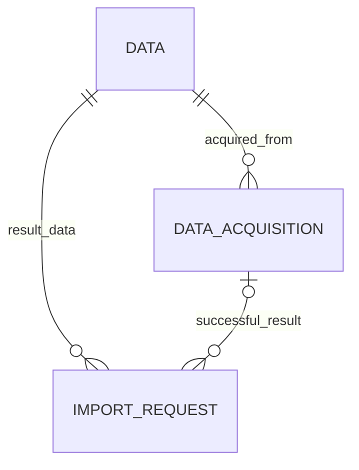

# T02용 PostgreSQL 저장 스키마 초안

상태: **T01 REVIEW DRAFT 보존 / T02 별도 migration 구현·검증**. 원래 SQL/fixture 파일은 작성 당시 bytes를 보존한다. 후속 T02는 이 D 계약을 [패키지 migration](../../src/palimpsest/migrations/0001_data.sql)과 Python/psycopg runner로 구현해 독립 PostgreSQL 18.6/pgvector 0.8.6에 적용했다. [실행 profile](../implementation/T02_RUNTIME.md)과 [파일 복구·DB 동시성·SQL fixture 실제 결과](../../progress/T02_execplan.md)를 따른다. 전체 I/K/W 설계나 P01–P12의 일괄 승인은 아니다.

후속 [D/I/K/W 저장 스키마 v1](DIKW_STORAGE_SCHEMA_V1.md)에 전체 참조·필드·commit·migration 계획을 정리했다. 이 문서의 세 테이블과 SQL 파일은 첫 D vertical slice의 초안으로 유지한다. I/K/W/Runtime 전체 물리 테이블을 T02에 함께 생성하라는 지시가 아니다.

## 파일과 적용 범위

- [T02_storage_draft.sql](T02_storage_draft.sql): 새 테스트 DB용 extension/schema/세 테이블/제약/트리거 초안.
- [T02_storage_checks.sql](T02_storage_checks.sql): 같은 schema에서 transaction rollback으로 끝나는 SQL 검증 fixture. 실제 원본을 읽는 앱 테스트가 아니다.

최초 대상으로 PostgreSQL major 18을 검사하고 조회된 pgvector 0.8.6을 명시한다. extension binary는 서버에 별도로 설치되어 있어야 한다. 최신 안정판 확인 및 실제 설치 version/digest 기록을 거친 뒤 초안을 실행 profile에 맞춰 고정한다. IF NOT EXISTS로 기존 schema/extension 불일치를 숨기지 않으며 기존 데이터가 있는 DB에 재적용하지 않는다.

## 관계



| 테이블 | 역할 | 주요 제약 |
|---|---|---|
| canonical_store.data | 등록 완료한 불변 원본 metadata | 64자리 lowercase SHA-256 PK, hash 기반 artifact_path, 비음수 크기, 변경·삭제·truncate 차단 |
| canonical_store.data_acquisitions | 명시적인 수집 provenance | UUIDv7 PK, Data FK, append-only, 같은 D에 여러 acquisition 가능 |
| compiler_runtime.data_import_requests | staging 후 등록 의도·복구·중복/retry 결과 | UUIDv7 request PK, 고정 입력 fingerprint, 상태 전이, Data와 acquisition의 일치 FK |

data.sha256은 data_id의 generated column이므로 별도 입력으로 ID와 다른 hash를 저장할 수 없다. 필드 이름을 기존 최소 metadata와 맞춘 표현이다. actor_ref와 origin_uri는 외부 provenance 값이며 새로운 UUIDv7 객체를 임의로 만들지 않는다. 외부 metadata만 JSONB를 허용하고 핵심 result 관계는 typed FK로 둔다.

artifact_path는 `objects/sha256/<처음 두 hex>/<전체 hash>`다. 앱은 configured Artifact Store root를 기준으로 읽으며 input의 임의 경로를 이 필드에 저장하지 않는다. staging 경로는 `staging/<request UUIDv7>/payload`로 분리한다. path의 실제 containment, symlink/reparse point, file durability와 content hash 검증은 filesystem adapter에서 수행한다. SQL CHECK만으로 파일의 존재·무결성을 보장할 수 없다.

## 등록 transaction과 실패 복구

입력 bytes를 staging에 보존·검증한 뒤 staged journal을 만든다. request_fingerprint는 versioned command envelope의 payload_sha256, byte_size, MIME과 등록 metadata/actor를 결합하며 임의 파일명만으로 idempotency를 판단하지 않는다. journal에 기록된 원본 의도는 변경하지 않는다.

`staged → published → committed`가 정상 경로다. staged/published에서 이미 같은 D가 확인되면 duplicate로 종료한다. 실패는 failed로 남기고 명시적 retry는 고정된 입력을 확인해 staged로 돌아간다. committed/duplicate receipt는 변경하지 않고 조회한다. 실패별 상세 운영 로그의 보존 방식은 후속 runtime 구현에서 정한다.

등록 서비스의 commit은 Data insert + 최초 acquisition insert + journal의 committed/result 갱신을 한 transaction으로 수행한다. request row lock으로 같은 요청의 재실행을 직렬화하고 Data PK로 다른 요청의 동일 bytes 경쟁을 막는다. 파싱/복사 중 DB lock을 유지하지 않는다. 충돌 패자는 insert transaction을 rollback한 뒤 winner의 readable Data를 조회하고 자기 요청을 duplicate로 종료한다.

commit 뒤 응답이 유실돼도 같은 request ID와 같은 입력은 저장된 성공 result를 반환한다. 새 request로 같은 bytes를 제출한 경우와 구분한다. duplicate는 Data/acquisition/D2I를 새로 만들지 않으며 입력 파일은 그대로 둔다. 별도 출처를 의도적으로 기록할 때만 acquisition을 추가한다.

prepared journal 이전 crash는 해당 staging 파일이 미등록 상태로 남는 경우다. journal 이후 crash는 입력 hash/frozen metadata와 파일의 publish 여부를 확인해 재개한다. shared objects 파일의 자동 삭제는 하지 않는다. 이 스키마의 receipt만으로 file+DB의 원자성이 생기지 않으므로 AT56/110의 파일 failpoint 검증이 필요하다.

## SQL에서 보장하는 범위와 앱 책임

SQL은 Data/ID/hash 형식, PK/FK와 acquisition 소속, 불변 snapshot, journal 입력 불변성·상태 전이·결과 모양을 검사한다. request fingerprint를 직접 계산하거나 파일 상태를 확인하지 않는다. runtime row를 committed로 바꾸기 전에 Data와 acquisition metadata가 준비한 요청과 일치하는지 서비스가 검사해야 한다.

DB role 분리는 실행 환경 선택 후 migration owner와 runtime/조회 역할로 구체화한다. 초안은 PUBLIC 권한을 회수한다. owner/superuser의 직접 SQL까지 domain 승인으로 취급하지 않는다. authorized deletion/보관 만료 절차가 정해지면 별도 migration/운영 경로를 검토하며 지금 임의 CASCADE 삭제를 넣지 않는다.

아직 만들지 않는 테이블: I/K/W/P/B, general Compiler Records, 임시 후보, embedding profiles/vectors 및 ANN index. 해당 작업의 확정된 refs·enum·모델 profile과 함께 후속 migration에 추가한다. 미승인 public K revalidation 이름과 무의미한 성공 stub이 들어가지 않게 한다.

## 후속 실행 명령과 통과 조건

아래는 **미실행 명령 템플릿**이다. PALIMPSEST_TEST_DSN은 사용자가 승인한 독립 테스트 DB를 가리켜야 하며 비밀을 로그에 출력하지 않는다. schema 파일은 이미 같은 테이블이 있는 DB에서 실행하지 않는다.

```text
psql -X --set=ON_ERROR_STOP=1 --dbname=<PALIMPSEST_TEST_DSN> --file=docs/schema/T02_storage_draft.sql
psql -X --set=ON_ERROR_STOP=1 --dbname=<PALIMPSEST_TEST_DSN> --file=docs/schema/T02_storage_checks.sql
```

SQL fixture는 UUIDv7/hash/path/duplicate/FK/state/불변성을 검사한다. 파일 import·응답 유실·두 session의 경쟁·crash/reconcile은 T02 앱 테스트에서 따로 실행한다. PG19 업그레이드는 별도 사본에서 schema/extension/backup restore와 이 검사를 다시 통과해야 한다. 문서 validator나 SQL 텍스트 검사가 이 실행 결과를 대신하지 않는다.

## 독립 검토 반영

같은 request의 staging 생성 전부터 배타 소유권을 확보하고 기존 staging을 덮어쓰지 않는다. 다른 request가 hash object만 먼저 publish한 경우 동일 bytes·hash·크기를 검증해 자신의 commit 경로를 계속할 수 있다. object 존재만으로 Data 중복이라고 판정하지 않으며 canonical Data PK가 최종 중복 경계다. 같은 request row의 DB lock은 이 filesystem 배타 소유와 별개로 필요하다.
