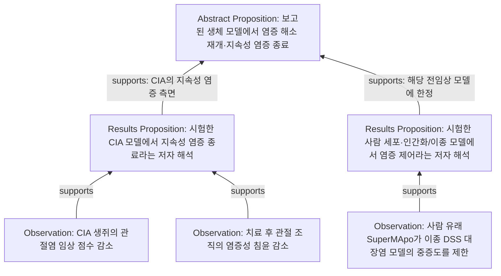

# Test_Paper I2K → N2E 실제 실험

2026-09-11. **Observation → Results Proposition → Abstract의 조건부 결론 Proposition 연결을 실제로 생성하고 PostgreSQL에 저장했다.** 첫 출력 그대로 성공한 것은 아니다. 인용 오류를 구조검사로 차단했고, 관측 중심 생성에 Results 해석 패스를 추가했으며, Proposition 간 supports를 잘못 거부한 Validator 지침을 보완한 뒤 새 실행에서 다시 판정했다.

## 최종 저장 결과

| 항목 | 실제 결과 |
|---|---:|
| 입력 | 기존 Test_Paper 그룹 I 22개, I 이미지 36개, 원본 14쪽 |
| KNode | 27개: Observation 19 / Proposition 8 |
| KNodeRevision | 27개 |
| KEdge / KEdgeRevision | supports 21개 / 21개 |
| 방향 | Observation → Proposition 18개, Proposition → Proposition 3개 |
| 원문 grounding | exact I 인용·문자 범위 34개 |
| Observation → Proposition → Proposition 경로 | 9개 |
| DB의 잘못된 endpoint 소유자 / quote 불일치 | 0 / 0 |
| terminal 처리 후 임시 후보 | 0개 |
| 모델 호출 | Terra Medium 9회: 구조 실패 1회 포함 |

원본 Data SHA-256은 `a2268b37570f41bb07189cf083376e5823fae364165d5e0e256f796a0814cffe`다. 새 OCR/D2I 개선은 하지 않았고 frozen parser 결과로 기존 source I를 복원했다. 기존 grouped I와 내용·content/identity fingerprint가 일치함을 대조했다. 이전 실험의 UUID를 덮어쓰지 않고 [ID 대응표](source/historical-id-map.json)를 보존했다.

실제 graph는 [graph.json](graph.json), [Node 목록](nodes.csv), [Edge 목록](edges.csv), [경로와 검증 요약](graph-summary.json)에서 볼 수 있다. [DB 직접 검증](database-verification.json)은 PostgreSQL **18.6**, pgvector **0.8.6**, 네 실행의 상태와 실제 호출 receipt를 기록한다.

## 실제 생성된 연결 예

아래는 저장된 graph의 읽기 쉬운 한국어 표시다. 문장 전체와 실험 조건, exact Revision ID는 CSV/JSON에 있다. supports는 해당 조건과 결론의 일부를 뒷받침하는 관계이며 임상 효능이나 논리적 증명을 뜻하지 않는다.



첫 예의 NodeRevision 경로는 `01a08ef3-573e-74a5-9a82-2a681c807683` → `01a08ef7-7386-7205-85a4-e95caf7ffe6e` → `01a08ef3-575f-75dd-a420-33be3ff84efb`다. 이 두 연결의 EdgeRevision은 각각 `01a08efb-3521-7950-bad5-bac03ed64eaf`, `01a08eff-bf7b-7f63-8cb6-2823ce4c0ceb`다.

9개 경로는 하나의 논문에서 공유한 근거의 여러 연결 경로다. 독립 논문 9편이나 독립 검증 9회를 뜻하지 않는다. Abstract/Results는 grounding의 문서 역할이며 그 역할 때문에 별도 Node를 강제로 만들지 않았다. 좁은 결과 해석과 넓은 조건부 결론이 실제로 다른 경우 연결했다.

## 실제 실행과 발견한 실패

1. 첫 Generator는 16개 후보를 만들었지만 exact quote 5개가 I에 없어 반영하지 않았다. 실행 실패 call metadata를 보존하고 구조 오류를 반환했다. 일부 군집/관측·해석 혼재도 독립 감사에서 발견됐다.
2. 재생성한 21개는 exact quote 검사를 통과했고 별도 Terra Validator가 21개를 수용했다. Node/Revision/grounding을 atomic 저장했다. 이후 검토에서 일부 인용은 정확하지만 너무 짧다는 한계가 드러났다.
3. 첫 패스가 측정에 치우쳐 있어 각 Results 절의 실제 해석을 별도로 생성했다. 기존 21개 Node를 비교 대상으로 제시한 뒤 새 Proposition 6개를 생성·독립 판정·저장했다. 기존 multifactor/Abstract 결론은 중복 생성하지 않았다.
4. N2E는 canonical DB에서 조회한 27개 exact NodeRevision과 grounding을 입력받았다. 관계 후보 21개 중 18개를 수용하고 3개를 기각했다. 이때 두 기각은 Proposition 간 연결 자체를 독립 관측이 아니라는 이유로 거부한 것으로, 허용된 관계 의미와 맞지 않았다.
5. 지침에 “서로 다른 Proposition의 제한적 inferential support는 허용하되 같은 출처를 독립 증거로 세지 않는다”를 명시했다. 기존 판정은 수정하지 않고 새 N2E 실행을 준비했다. 새 후보 3개를 별도 Validator가 수용하여 최종 21개 Edge가 됐다.

이 결과는 정교해진 지침과 분리된 생성·검증 패스를 사용하는 첫 실행 사례다. 한 번의 일반 프롬프트로 안정적으로 완성됐다는 결과가 아니며, JSON schema만으로 의미적 결정론이 확보된 것도 아니다.

모든 호출은 승인된 기존 Codex OAuth의 요청 모델 `gpt-5.6-terra`, reasoning `medium`, CLI `0.153.4`였다. 실행기가 별도 backend resolved model을 보고하지 않아 요청 profile과 실제 완료 receipt 범위만 확인했다. 9회 합계는 input tokens 445,427, output tokens 19,676, 보고된 reasoning output 2,612, 호출 경과시간 합계 415.344초다. OAuth 비용을 금액으로 환산하지 않았다.

## Revision·원문·판정 보존

논리 KNode/KEdge ID와 각각의 immutable Revision ID를 분리했다. EdgeRevision이 연결하는 것은 정확한 NodeRevision이며, 소유자 복합 FK를 검사한다. Node grounding은 exact I ID/문자 범위/quote/media SHA로 이어지고, I를 통해 원본 Data/page/bbox/raw/segment provenance로 이어진다. 모델 출력의 ID·FP·offset을 그대로 권위로 사용하지 않는다.

이번 논문 graph는 최초 입력이므로 모두 initial Revision이다. 임의로 논문 주장을 수정해 Revision 2를 만들지 않았다. 의미 변경 successor, stale 경쟁, 과거 endpoint 불변, endpoint만 바뀐 applicability, 동일 의미 재사용은 별도 synthetic PG fixture에서 검증했다. 일반 material revision 제안·판정 CLI와 K2K 전체 전파는 후속 범위다.

K effect, 원문 grounding, terminal Runtime Record, 후보 cleanup, 후속 outbox를 한 transaction으로 저장했다. 기록은 Canonical Store로 이동하며 삭제되지 않고 Compiler Runtime에 유지된다. 비교 catalog는 JSON snapshot과 global K state freshness로 보호하고, source I 및 N2E endpoint 입력은 typed FK다. 모든 비교 catalog 입력의 typed FK까지 구현했다고 주장하지 않는다.

최초 I2K 입력에는 I text와 해당 I 이미지 36개를 실제 전달했다. 원본 PDF나 전체 페이지 이미지는 자동 첨부하지 않았다. 실제 이번 호출에서 원본 요청은 0개다. 현재 Codex CLI adapter가 원본 PDF bytes를 직접 전달하는 경로는 미구현이며, 필요 요청은 unavailable로 기록하고 영향받는 후보를 보류하도록 PG 검사했다.

## 의미 품질의 한계

저장 구조와 실제 지식 추출 품질은 구분해야 한다. [독립 의미 감사](semantic-audit.md)는 모델 출력 전에 고정한 [source oracle](oracle.md)과 비교한다. 원문에서 고정한 35개 인용은 현재 I와 정확하게 대응했다.

- 일부 저장 인용은 짧아 주체·비교군·시간·용량 등 semantic 조건 전체를 직접 보여주지 못한다. 전체 I에는 근거가 있어도 exact span이 충분하다는 판정은 별도다.
- 급성 염증의 12h/24h 대비, 일부 음성 재구성 실험 등 중요한 결과가 첫 Node 추출에서 빠졌다. 원문 I 누락과 K 추출 누락을 구별해야 한다.
- 모든 결과 영역이 Abstract까지 이어지지는 않는다. 대표 chain이 생성됐다는 확인을 논문의 완전한 의미 coverage로 해석하면 안 된다.
- 방법/출처나 결론의 한 부분만 뒷받침하는 약한 supports가 포함돼 있다. 사용 시 qualifier와 출처를 함께 읽어야 하며 전체 결론의 독립적 확증으로 세지 않는다.

후속 우선순위는 Observation의 실험·조건별 분리, 조건 전체를 뒷받침하는 인용 검사, 음성/시간대비 결과 coverage 검사다. D2I를 다시 바꾸기 전에 I2K/N2E의 이 검증을 강화하는 편이 이번 결과에 맞다.

## 검증·배포 상태

전체 앱 검사: **388개, 통과 372, 기존 PDFium 환경 skip 16, 실패/오류 0**. 새 K 검사 21개는 순수 계약 9개, 실제 PG constraint 6개, 실제 Runtime integration 6개이며 모두 통과했다. [앱 로그](app-tests.log)를 보존했다. 이 검사는 fake provider receipt를 이용한 저장 검사와 실제 Terra 의미 실험을 구분한다.

문서 validator는 기존 raw Markdown 오류 12개로 실패했다. Windows 문서 테스트는 긴 경로 clone 오류를 추가로 냈고, 같은 조건을 Linux에서 실행하니 **44개 중 43개 통과, 기존 baseline 실패 1개, 오류 0개**였다. 오류 집합은 기존과 동일하며 원문을 수정하거나 검사를 완화하지 않았다. [Linux 검사 요약](document-tests-linux-summary.json)을 참고한다.

성공한 실제 DB는 Docker Compose 프로젝트 **`palimpsest-knowledge`**에 유지한다. 앱은 **`palimpsest-knowledge:0.3.0`**, image SHA는 [image-id.txt](image-id.txt)에 고정했다. 별도 synthetic `palimpsest-k-checks`의 컨테이너·볼륨을 정리했고, 이번 작업의 제거 가능한 추가 dangling 이미지는 없었다. [정리 내역](docker-cleanup.json)이 있으며 작업 전 사용자의 기존 Docker 자원은 대상으로 삼지 않았다.

R08에 따라 기각 Edge 3개의 임시 DB 본문은 terminal 반영과 함께 제거했다. 감사를 마친 뒤 해당 본문을 포함한 로컬 교환 파일 3개도 제거하고 accepted subset·FP·판정 이유·호출 metadata만 남겼다. [정리 기록](rejected-exchange-cleanup.json)은 범위와 원래 파일 hash를 기록한다.

```powershell
docker compose -p palimpsest-knowledge run --rm --no-deps -T app knowledge graph --data-id a2268b37570f41bb07189cf083376e5823fae364165d5e0e256f796a0814cffe --json
```

네 I2K/N2E 실행은 이 실험의 후보 판정 범위에서 completed다. **후속 outbox 의무 48개는 pending**이며, 전체 propagation의 종료나 T04/T06/K2K 전체 acceptance 완료로 표시하지 않았다. 모델의 source selection·identity·관계 판정에 사람의 지침 조정이 필요했던 지점을 기록한, 실제 첫 K 저장 실험이다.
