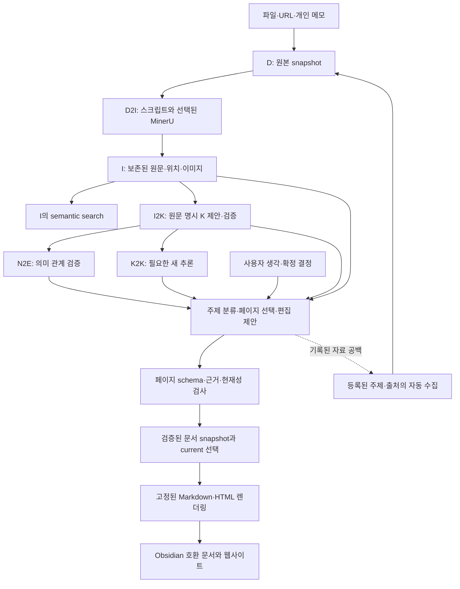

# 자동으로 확장되는 규격화 Wiki — 제품 중심 설계안

2026-09-12. 사용자의 최신 목표는 **자료를 넣으면 자동 분류하고, 관련 내용을 일관된 백과사전형 페이지로 작성·갱신하며, 장기적으로 인터넷 자료도 자동 수집하는 Obsidian 스타일 Wiki**다. 개인 생각과 실제 결정도 함께 관리한다. D/I/K는 형식·근거·지식 상태의 일관성을 위한 내부 구조다. 연구용 평가나 ADR 관리만으로 제품 목표를 좁히지 않는다.

이 문서는 권고 설계와 첫 검증 범위다. 현재 앱에 페이지 저장·웹 UI·crawler가 구현됐다는 뜻이 아니며, P의 입력 정의나 publication policy를 이미 변경한 것도 아니다. 새로운 웹 수집·주기 작업·모델 호출·공개 배포를 시작하지 않았다.

## 가장 중요한 설계 판단

**D/I/K는 원문과 지식의 경계를 지키고, 별도의 page schema와 deterministic renderer가 문서 형식을 지킨다.** LLM에게 완성된 Markdown을 자유롭게 쓰고 기존 파일을 덮어쓰게 하지 않는다. LLM은 주제 분류, 기존 페이지 선택, 근거 있는 내용과 배치를 구조화된 편집 제안으로 반환한다. 프로그램이 주소·레이아웃·인용·링크·저장과 이력을 관리한다.

기존 D/I/K와 PostgreSQL·Artifact Store·Compiler Runtime은 활용한다. 모든 자료를 K로 만들거나 모든 K를 통합할 필요는 없다. 기존 구현에 빠져 있는 핵심 제품 기능은 **자동 편집과 페이지 갱신**이며, 이것을 첫 사용자 관찰 가능한 목표로 삼는다.

## 전체 흐름

그림은 제품 흐름이다. 직접적인 모듈 재귀 호출이나 모든 단계 완료 전 출력 금지라는 뜻이 아니다. 작업 연결은 기존 durable execution/outbox 원칙을 사용한다. K2K나 Decision 기능이 미완료여도 원문에 충실한 기본 Wiki 페이지 생성은 별도 작은 범위로 시험할 수 있다.

## 페이지 형식을 고정하는 방법

### 페이지 데이터와 렌더링을 분리한다

첫 schema는 백과사전 문서 한 종류로 작게 시작한다. 제목·짧은 개요, 보고된 주요 내용, 조건·방법, 한계·상충, 관련 자료, 출처를 정해진 순서로 표현한다. 의미 없는 빈 섹션은 template의 고정 규칙으로 숨기거나 정보 부족으로 표시한다. 없는 내용을 채워 넣지 않는다.

추가로 필요한 source 소개, 개인 생각, 결정 문서는 별도 template로 확장하되 공통 identity·인용·이력을 공유한다. page kind는 문서 형식이며 기존 K의 kind나 새 D/I/K domain이 아니다. taxonomy와 template의 변경도 버전으로 관리한다.

권고하는 page payload의 개념적 필드는 다음과 같다. 실제 SQL/wire schema는 아직 미확정이다.

| 필드 | 역할 |
|---|---|
| page identity와 expected current snapshot | 제목 변경·재실행·동시 갱신에서도 같은 페이지를 식별 |
| template ID/version | 고정된 section과 출력 규칙 선택 |
| title·aliases·scope·categories | 주제 분류와 검색·탐색. 이름만으로 identity 확정 금지 |
| section별 typed block 목록 | paragraph/list/table/image 등 허용된 본문 구조와 순서 |
| block별 exact KRevision/I/W refs | 각 설명의 근거와 당시 사용한 내용 추적 |
| related page IDs | 탐색 링크. supports와 구분 |
| 생성·검증·표현 profile | 무엇이 어떤 규칙으로 작성·검증·렌더링됐는지 보존 |
| 공개 범위 | 개인용/공개용 출력의 분리 |

LLM은 허용된 section key와 block 내용만 선택한다. 프로그램이 필수 필드·허용 타입·추가 필드 금지·참조 소유권을 검사한다. 파일 경로, 인용 번호, backlinks와 heading 표기를 모델에 맡기지 않는다. paragraph 안의 임의 Markdown heading이나 HTML이 template를 탈출하지 않도록 허용된 inline 표현만 렌더링한다.

동일한 구조화 payload와 renderer version에서 같은 문서 bytes를 만들 수 있다. 반면 LLM의 분류·요약·근거 선택까지 매번 동일하다고 보장하는 것은 아니다. 형식 검사와 의미 검증은 계속 구분한다.

## 자동 분류와 페이지 갱신

1. 기존 I의 의미와 metadata를 이용해 관련 주제·기존 페이지 후보를 찾는다. BGE-M3 기본 검색 계약을 유지하며 페이지 검색과 I 검색을 구분한다.
2. LLM이 기존 페이지 갱신, 새 페이지 생성, 여러 페이지 반영, 또는 모호함 보류를 제안한다. D2I에 application LLM을 넣지 않는다. 분류는 이후 편집/의미 처리 역할이다.
3. 정확한 주제·대상·범위로 페이지 identity를 검증한다. 동일한 제목/slug만으로 동명이인·다른 프로젝트·다른 버전을 합치지 않는다. 제목은 바뀔 수 있고 aliases는 기존 주소를 유지한다.
4. 새 자료와 현재 페이지의 실제 I/K 근거를 읽어 필요한 부분을 갱신한다. 과거 페이지 문장만 근거로 재요약하지 않는다. 변경하지 않는 부분은 검증된 refs와 함께 보존한다.
5. 원문 지지·인용·링크·schema·현재성을 확인한 결과만 새 snapshot으로 저장하고 current 선택과 링크 집합을 원자적으로 갱신한다. 실패한 후보는 공개 current로 선택하지 않는다.
6. citation과 backlinks는 저장된 refs에서 계산한다. 같지 않은 두 source의 관측은 같은 페이지에서 함께 설명할 수 있지만 K identity는 유지한다. 한 K가 여러 페이지에 등장할 수도 있다.

신규 자료가 아무 변화도 만들지 않으면 검토 기록만 남길 수 있다. 같은 request/input 재시도는 같은 결과를 재사용하고, 다른 writer가 current를 바꿨으면 stale 편집안을 재검토한다. 제목·스타일·페이지 배치가 바뀌었다는 이유로 K semantic Revision을 만들지 않는다.

## I와 지식의 경계

- I는 독립적인 원문 보존·semantic search 대상이다. 페이지나 K가 선택하지 않은 세부 사항도 I에서 찾는다.
- 페이지가 I를 직접 인용하는 경우와 검증된 K를 표현하는 경우를 구분한다. 모든 I를 K로 승격해 페이지에 넣을 필요는 없다.
- 페이지 편집기는 기존 근거를 고르고 원문에 충실하게 표현한다. 새로운 관계·가설·결론을 만들 필요가 있으면 별도 K2K를 사용하고 추론 기원을 표시한다. 위키에 문장을 썼다고 canonical K가 자동 생성되지 않는다.
- 인용이 원문에 존재하는지와 주장을 충분히 지지하는지는 별도 검증이다. 현재 처치군 범위 확대/불완전한 인용 문제는 자동 발행 전에 해결해야 한다.
- I 안의 근거가 부족하면 기존 I의 다른 범위, 다른 I, 등록 원본 D를 실제로 확인하고 사용·결손 기록을 남긴다. 그 이유로 D2I를 다시 실행하지 않는다.

## 기존 W/P/B와의 연결

현재 P는 immutable document snapshot이고, 수정은 새 P와 supersedes_parchment_id로 표현한다. 이를 페이지 내용의 snapshot으로 재사용하고 안정적 페이지 주소/current 선택을 publication catalog/view에서 관리하는 안이 가장 작다. 별도의 ParchmentRevision이나 Page를 KNode로 만드는 방법은 필요하지 않다. B는 특정 시점의 문서 묶음·배포 manifest에 유용하며 조회마다 생성할 필요는 없다.

**좁은 계약 변경이 필요하다.** 현재 canonical P는 하나 이상의 W를 구성한 문서다. 일반 백과사전 페이지를 만들기 위해 형식적인 W를 매번 만들어 끼워 넣기보다, exact K/I만으로도 P를 구성할 수 있도록 입력을 확장하는 안을 권고한다. 이는 아직 적용·승인된 정의가 아니다. 첫 read-only page projection 실험과 정식 P 저장을 구분하고, 정식 구현 전 P 입력·page identity/current 선택·자동 발행 조건을 구체 schema와 영향으로 검토한다.

개인 생각은 작성자에게 귀속된 내용으로, 실제 결정은 actor가 확정한 사건으로 보존한다. LLM이 생각을 정리했다고 사용자가 결정한 것으로 만들지 않는다. 확정 Decision W와 deterministic W2K의 기존 계약은 유지한다. 개인 페이지·결정 페이지와 일반 백과사전 서술도 template와 attribution으로 구별한다.

## 웹사이트와 Obsidian 출력

핵심 앱은 Python/Docker와 PostgreSQL 18·pgvector를 유지한다. 첫 출력은 Python renderer가 생성한 Markdown으로 검증한다. 내보낸 파일에는 일정한 frontmatter, wikilinks, source citations를 넣어 Obsidian에서 읽을 수 있도록 한다. Markdown은 DB를 다시 구성하는 유일한 원장이 아니라 구조화된 snapshot에서 재생성 가능한 출력으로 둔다. export를 직접 편집했다면 조용히 canonical을 덮어쓰지 않고 별도 사용자 편집 제안으로 처리한다.

웹 게시기는 교체 가능한 출력 adapter다. [Quartz](https://quartz.jzhao.xyz/)는 Markdown 사이트와 Obsidian 호환 기능을 제공하고, [backlinks](https://quartz.jzhao.xyz/features/backlinks)와 [graph view](https://quartz.jzhao.xyz/features/graph-view)를 지원하므로 후보로 참고할 수 있다. 조회한 홈페이지는 Quartz 5이며 Node 기반 빌드 도구다. Python 앱을 대체하지 않지만 추가 빌드 runtime이 필요하다. Python-only 배포 경로를 원하면 먼저 Python의 고정 HTML 출력으로 시작할 수 있다. 이번에 frontend/framework를 설치·확정하지 않았다.

웹 페이지의 기본 검색/graph와 서버의 I semantic search는 별도다. 정적 사이트 기능이 I 검색이나 exact D 확인 기능을 자동 구현해주지 않는다. 현재 CLI-first/GUI-last의 단계는 유지하고, 최종 사이트 목표를 지금 바로 GUI scaffold/공개 배포하라는 지시로 해석하지 않는다.

## 인터넷에서 스스로 확장하는 방법

자료 확보와 위키 편집은 두 worker 역할로 구분하되 별도 microservice를 필수로 만들지 않는다.

- 먼저 사용자가 정한 주제·RSS/API·허용 출처·문서 집합에서 새 자료를 찾는다. 페이지의 부족한 정보는 다음 수집의 힌트가 될 수 있지만 무제한 범위 확대 명령이 아니다.
- fetched URL, 수집 시각, 응답/파일 hash와 출처 metadata를 남기고 D 등록으로 연결한다. URL의 동일성과 bytes의 동일성은 다르다. 같은 bytes는 새 Data/D2I를 만들지 않고, 실제 bytes가 바뀌면 새 D를 보존해 이전 원본을 덮어쓰지 않는다.
- conditional fetch, 요청 중복 방지, 재시도·중단/재개, site별 속도 조절은 수집기의 책임이다. 규모가 필요해질 때 [Scrapy의 persistent jobs](https://docs.scrapy.org/en/latest/topics/jobs.html)와 [AutoThrottle](https://docs.scrapy.org/en/latest/topics/autothrottle.html)를 참고한다. 지금 별도 scheduler/broker를 추가할 필요는 없다.
- robots/access policy와 수집 범위를 따르고, 외부 페이지에 적힌 지시가 실행·수집 범위·발행 권한을 바꾸지 못하게 한다.
- 수집은 곧 발행이 아니다. 미해결 근거/분류 문제는 보류로 남기고 검증된 변경만 current 문서로 선택한다. 안전하게 검증된 갱신까지 매번 사람의 확인을 강제할 필요는 없지만 자동 발행의 범위와 검토 조건은 명시해야 한다.
- 수집량·동시성·실행 주기 조절은 운영 정책이다. 처리하지 못한 작업이나 후속 재검토를 token/시간/개수 제한 때문에 성공 완료로 표시하지 않는다.

기본은 개인 위키로 두고, 공개 허용된 내용만 별도 출력으로 만드는 안을 권고한다. 개인 생각/결정과 원문 assets가 인터넷 수집 내용과 섞였다고 자동 공개돼서는 안 된다. 공개 집합을 사이트 빌드 전에 계산하고 page body뿐 아니라 citations, backlinks, graph/search index, attachments에도 적용한다. 이번 설계가 원문 재배포·로그인 사이트 수집·외부 공개의 포괄 승인은 아니다.

## 가장 작은 첫 구현과 검증 순서

### A. 자동 페이지 생성의 작은 범위

고정된 encyclopedia template 하나, 현재 D/I/K를 읽는 page planner, schema/evidence 검사, Python Markdown renderer를 먼저 연결한다. 처음에는 read-only publication projection으로 검증한다. 정식 snapshot/current catalog 저장은 위의 좁은 계약 변경을 확정한 후 추가한다.

고정한 두 source fixture로 다음을 확인한다.

1. 첫 자료 등록 후 적절한 주제 페이지를 자동 선택/생성하고 정해진 형식과 인용으로 출력한다.
2. 명백히 같은 주제의 두 번째 자료가 기존 page identity를 갱신하고 이전 snapshot·근거를 보존한다. 다른 실험의 K를 합치는 것은 요구하지 않는다.
3. 같은 입력 재시도에서 페이지/K를 중복 생성하지 않는다.
4. 모델이 임의 heading·파일 경로·허용되지 않은 field·없는 refs를 내면 반영하지 않는다. 같은 payload/version의 렌더링은 동일하다.
5. 원문 범위 확대와 인용 부족을 막고, 정보가 없으면 그 사실을 드러낸다.
6. 제목 변경·재렌더링 후 링크·backlink가 유지되며 stale 제안은 current를 덮어쓰지 않는다.

### B. 자료와 페이지의 축적

등록된 source를 추가하면서 분류·기존 페이지 선택·내용 충돌·근거 추가를 평가한다. 페이지형 문서의 품질과 K 검증을 함께 보되, 문서 형식 일치율과 원문 충실성은 다른 지표로 보고한다. source I 전체가 I2K 검토 루프에 들어가는 기존 의무와 페이지별 선택 근거를 구분한다.

### C. 자동 수집

하나의 허용된 RSS/API/사이트 adapter를 수집 입구로 연결한다. 변경 없음은 새 Data/페이지를 만들지 않고, 변경 있음은 기존 페이지의 필요한 부분을 갱신하는지 검증한다. 이후 관심 주제와 페이지 공백 기반 발견을 확장한다.

### D. 사이트와 개인 기록

검증된 CLI/renderer를 사용하는 웹 게시·검색·원문 확인을 연결한다. 개인 생각·결정은 해당 template와 authority 규칙으로 추가하고, 개인용/공개용 export가 섞이지 않는지 검사한다. GUI·배포 착수는 기존 단계와 구체 사용자 지시를 따른다.

## 현재 구현과 달라질 우선순위

지금까지 K 생성·검증의 기반을 만들었지만 사용자에게 보이는 자동 페이지 생성/갱신은 아직 없다. 다음 성공 기준은 K 개수가 아니라 **첫 자료가 정해진 문서를 만들고, 두 번째 자료가 그 문서를 올바르게 갱신하는지**다. 현재 D/I/K를 폐기하지 않으며, page schema·editorial workflow·renderer를 제품 중심 기능으로 추가한다. W/Decision·K2K·P/B 전체를 먼저 완성해야만 위키의 모습을 시험할 수 있도록 묶지 않는다.

이번 작업에서는 관련 계약·실제 구현 현황과 공식 렌더링/수집 문서를 읽고 독립 설계 검토를 받았다. 제안 문서와 제품 목표 명확화만 기록했으며 앱·DB·모델·crawler·사이트 배포에는 변경이 없다.
